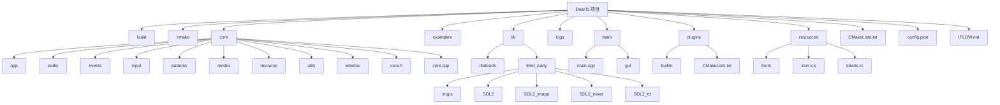
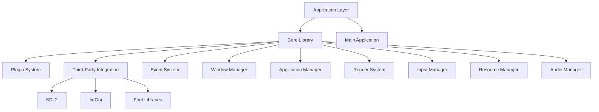
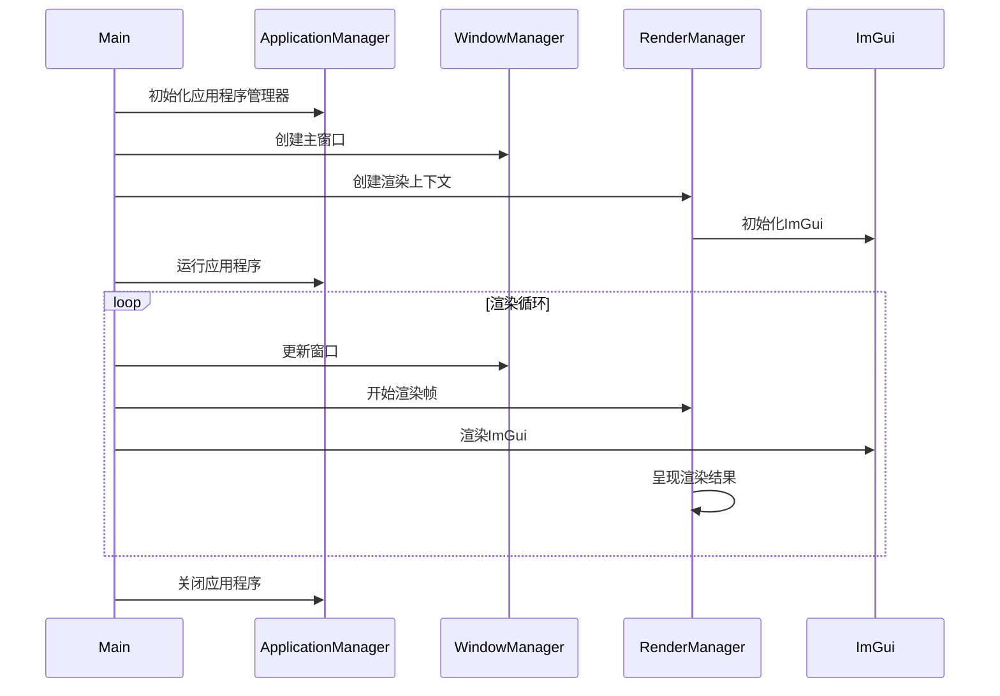

# DearTs 项目文档

## 项目概述

DearTs 是一个基于 SDL2 和 ImGui 的现代化 C++ 应用程序框架，采用分层架构、事件驱动和插件化设计。该项目旨在提供一个灵活、可扩展的应用程序开发平台，特别适用于需要复杂 UI 和高性能图形渲染的桌面应用程序。

## 项目结构



## 架构设计

### 分层架构



### 核心组件

1. **Application Manager（应用程序管理器）**
   - 负责应用程序的生命周期管理
   - 管理应用程序配置和插件系统
   - 提供全局事件处理机制

2. **Window Manager（窗口管理器）**
   - 管理应用程序窗口的创建、销毁和事件处理
   - 支持多窗口和自定义窗口标题栏
   - 集成 SDL2 窗口系统

3. **Event System（事件系统）**
   - 提供全局事件分发机制
   - 支持自定义事件类型
   - 实现观察者模式

4. **Render System（渲染系统）**
   - 基于 SDL2 的硬件加速渲染
   - 支持 ImGui 界面渲染
   - 提供纹理管理和渲染上下文

5. **Resource Manager（资源管理器）**
   - 管理应用程序资源（字体、图像等）
   - 提供资源缓存和加载机制

6. **Plugin System（插件系统）**
   - 支持动态加载和卸载插件
   - 提供插件依赖管理和生命周期控制

## 设计模式

### 单例模式 (Singleton Pattern)

项目中大量使用单例模式来管理核心组件：

- `ApplicationManager`
- `WindowManager`
- `RenderManager`
- `EventManager`
- `ResourceManager`
- `PluginManager`

### 观察者模式 (Observer Pattern)

通过事件系统实现观察者模式，组件可以订阅和响应特定事件。

### 适配器模式 (Adapter Pattern)

使用适配器模式将 `IRenderer` 接口适配到 `WindowRenderer` 接口。

## 技术栈

- **语言**: C++20
- **构建系统**: CMake
- **图形库**: SDL2
- **UI框架**: ImGui
- **字体支持**: SDL2_ttf
- **图像支持**: SDL2_image
- **音频支持**: SDL2_mixer

## 构建和配置

### 构建命令

```bash
mkdir -p build && cd build
cmake -G "Visual Studio 17 2022" -A x64 ..
cmake --build . --config Debug
```

### CMake 配置选项

- `DEARTS_BUILD_TESTS`: 构建测试 (默认: OFF)
- `DEARTS_BUILD_DOCS`: 构建文档 (默认: OFF)
- `DEARTS_BUILD_EXAMPLES`: 构建示例 (默认: OFF)
- `DEARTS_ENABLE_LOGGING`: 启用日志 (默认: ON)
- `DEARTS_ENABLE_PROFILING`: 启用性能分析 (默认: OFF)

## 核心流程



## 插件系统

插件系统允许动态扩展应用程序功能：

1. 插件以动态库(.dll/.so)形式存在
2. 插件需要实现 `IPlugin` 接口
3. 支持插件依赖管理和自动加载
4. 提供插件生命周期管理

## 资源管理

资源管理系统负责：

1. 字体资源加载和管理
2. 图像资源加载和缓存
3. 资源生命周期管理
4. 资源路径配置

## 性能优化

1. **渲染批处理**: 支持纹理渲染批处理以减少绘制调用
2. **资源缓存**: 纹理和字体资源缓存避免重复加载
3. **视口裁剪**: 支持视口裁剪以减少不必要的渲染
4. **性能分析**: 内置性能分析工具帮助优化应用性能