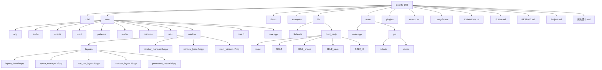
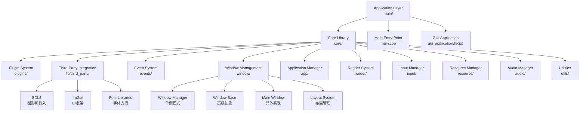
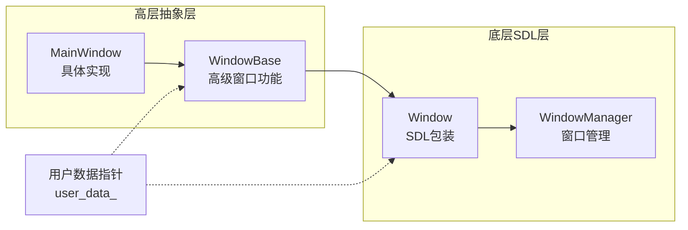
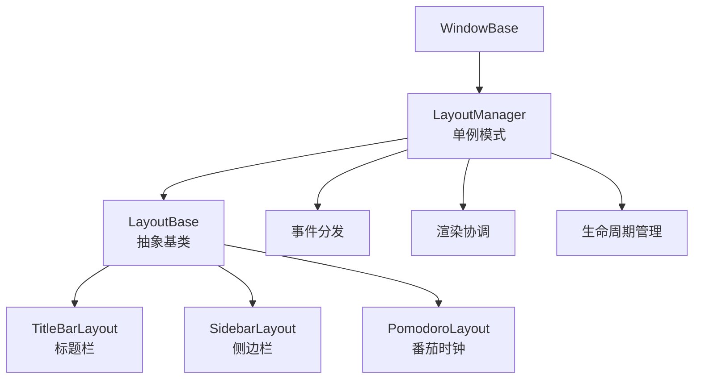
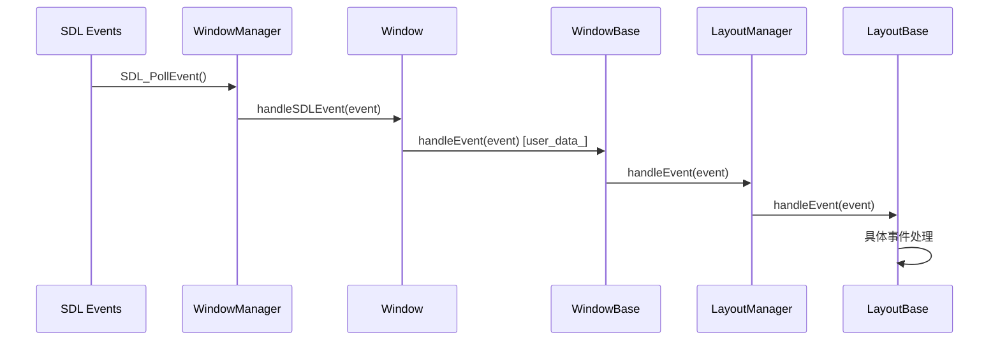

# DearTs 项目文档

## 项目概述

DearTs 是一个基于 SDL2 和 ImGui 的现代化 C++ GUI 应用程序框架，采用分层架构、事件驱动和插件化设计。该项目旨在提供一个灵活、可扩展的应用程序开发平台，特别适用于需要复杂 UI 和高性能图形渲染的桌面应用程序。

## 项目结构



## 架构设计

### 分层架构



### 核心组件

#### 1. **Application Layer（应用层）**
- **main.cpp**: 应用程序入口点
- **gui_application**: GUI应用程序的具体实现
- **application_manager**: 应用程序生命周期管理

#### 2. **Window System（窗口系统）**
- **WindowManager**: 单例模式，管理所有窗口实例
- **Window**: 底层SDL窗口包装
- **WindowBase**: 高级窗口抽象基类
- **MainWindow**: 主窗口的具体实现
- **Layout System**: 布局管理系统
  - **LayoutManager**: 布局管理器（单例）
  - **LayoutBase**: 布局基类
  - **TitleBarLayout**: 标题栏布局
  - **SidebarLayout**: 侧边栏布局
  - **PomodoroLayout**: 番茄时钟布局

#### 3. **Core Systems（核心系统）**
- **Event System**: 事件系统和分发机制
- **Render System**: 基于SDL2的渲染系统
- **Resource Manager**: 资源管理（字体、图像等）
- **Input Manager**: 输入设备管理
- **Audio Manager**: 音频播放管理
- **Utilities**: 工具类和辅助功能

#### 4. **Design Patterns（设计模式）**
- **Singleton**: WindowManager, LayoutManager
- **Composite**: WindowBase包含Window，LayoutManager包含Layout
- **Adapter**: Window适配SDL接口
- **Template Method**: WindowBase生命周期方法
- **Observer**: 事件分发机制

## 双层窗口架构

DearTs 采用独特的双层窗口架构设计：



### 关键特性

1. **Window（底层）**:
   - SDL窗口的直接包装
   - 处理原生SDL事件
   - 通过user_data_指针关联WindowBase

2. **WindowBase（高层）**:
   - 提供应用程序友好的接口
   - 集成布局管理器
   - 实现模板方法模式

3. **事件传播链**:
   ```
   SDL Event → WindowManager → Window → WindowBase → LayoutManager → LayoutBase
   ```

## 布局系统

布局系统是DearTs的核心创新之一：



### 布局特性

- **动态管理**: 支持运行时添加/移除布局
- **事件处理**: 每个布局独立处理事件
- **渲染控制**: 支持布局的显示/隐藏
- **位置管理**: 灵活的布局定位系统

## 事件系统

### 事件传播流程



### 支持的事件类型

- **窗口事件**: 创建、销毁、调整大小、移动
- **鼠标事件**: 点击、双击、移动、滚轮
- **键盘事件**: 按键按下/释放、组合键
- **自定义事件**: 应用程序特定事件

## 技术栈

- **语言**: C++20
- **构建系统**: CMake 3.20+
- **图形库**: SDL2
- **UI框架**: ImGui (1.90+)
- **字体支持**: SDL2_ttf
- **图像支持**: SDL2_image
- **音频支持**: SDL2_mixer

## 构建和配置

### 构建命令

```bash
# 创建构建目录
mkdir build && cd build

# 配置项目 (Windows with Visual Studio)
cmake -G "Visual Studio 17 2022" -A x64 ..

# 构建项目
cmake --build . --config Debug
```

### 运行应用

```bash
# Windows
build\Debug\DearTs_d.exe

# Linux/Mac
./build/DearTs
```

### CMake 配置选项

- `DEARTS_BUILD_TESTS`: 构建测试 (默认: OFF)
- `DEARTS_BUILD_DOCS`: 构建文档 (默认: OFF)
- `DEARTS_BUILD_EXAMPLES`: 构建示例 (默认: OFF)
- `DEARTS_ENABLE_LOGGING`: 启用日志 (默认: ON)
- `DEARTS_ENABLE_PROFILING`: 启用性能分析 (默认: OFF)

## 核心特性

### 1. 现代C++特性
- 智能指针内存管理
- RAII资源管理
- 模板和泛型编程
- 移动语义和完美转发

### 2. 高性能渲染
- SDL2硬件加速
- ImGui即时模式GUI
- 视口裁剪优化
- 批处理渲染

### 3. 灵活的布局系统
- 模块化布局组件
- 动态布局管理
- 事件驱动的UI更新
- 自定义布局支持

### 4. 插件系统
- 动态库加载
- 接口标准化
- 依赖管理
- 生命周期控制

## 开发工具

### 代码格式化
- `.clang-format`: 统一代码格式
- 支持主流IDE集成

### 版本控制
- Git版本控制
- 分支管理策略
- 提交信息规范

### 开发环境
- Visual Studio 2022
- CLion
- VS Code
- 跨平台支持

## 项目文档

- **README.md**: 项目概述和快速开始
- **Project.md**: 详细的项目架构文档
- **架构设计.md**: 深入的架构分析
- **IFLOW.md**: 开发流程和规范
- **core/window/README.md**: 窗口模块详细文档

## 性能优化

### 渲染优化
1. **智能重绘**: 只在内容变化时更新
2. **布局裁剪**: 只渲染可见区域
3. **批处理**: 减少绘制调用
4. **资源缓存**: 避免重复加载

### 内存管理
1. **智能指针**: 自动内存管理
2. **对象池**: 减少内存分配
3. **RAII**: 异常安全
4. **内存监控**: 内存泄漏检测

### 事件处理
1. **事件过滤**: 减少不必要的事件处理
2. **优先级队列**: 重要事件优先处理
3. **异步处理**: 非阻塞事件处理

## 扩展性

### 添加新布局
1. 继承`LayoutBase`类
2. 实现纯虚函数接口
3. 注册到LayoutManager
4. 处理事件和渲染

### 自定义窗口
1. 继承`WindowBase`类
2. 重写生命周期方法
3. 添加自定义布局
4. 实现特定功能

### 插件开发
1. 实现`IPlugin`接口
2. 编译为动态库
3. 放入plugins目录
4. 自动加载和初始化

## 测试和调试

### 单元测试
- Google Test框架
- 核心组件测试
- 模拟对象支持

### 调试工具
- 内存泄漏检测
- 性能分析器
- 事件追踪器
- 渲染调试器

## 总结

DearTs通过以下特点提供了一个强大而灵活的GUI应用程序框架：

1. **清晰的架构分层**: 职责明确，易于维护
2. **现代C++设计**: 充分利用语言特性
3. **灵活的布局系统**: 支持复杂的UI设计
4. **完整的事件处理**: 从底层到高层的完整链路
5. **可扩展的插件系统**: 支持功能模块化
6. **优秀的性能**: 多层次的性能优化

这个框架为构建复杂的桌面应用程序提供了坚实的基础，同时保持了代码的可读性和可维护性。