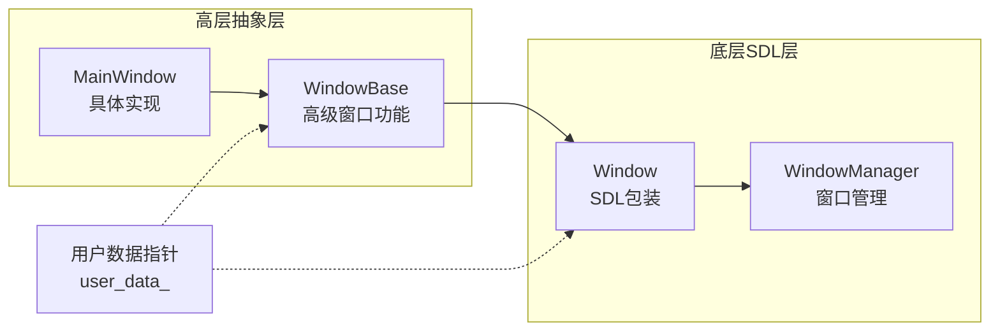

# DearTs

<div align="center">


**一个基于 SDL2 和 ImGui 的现代化 C++ GUI 应用程序框架**

[](https://en.wikipedia.org/wiki/C%2B%2B20)
[](https://www.libsdl.org/)
[](https://github.com/ocornut/imgui)
[](https://cmake.org/)
[](LICENSE)

</div>

## 📋 项目概述

DearTs 是一个现代化的 C++ GUI 应用程序框架，采用分层架构、事件驱动和插件化设计。它为开发者提供了一个强大而灵活的平台，特别适用于需要复杂用户界面和高性能图形渲染的桌面应用程序。

### ✨ 核心特性

- 🏗️ **分层架构设计**: 清晰的职责分离，易于维护和扩展
- 🪟 **双层窗口系统**: 独特的 Window + WindowBase 架构设计
- 🎨 **灵活布局系统**: 模块化布局组件，支持动态管理
- ⚡ **高性能渲染**: 基于 SDL2 硬件加速和 ImGui 即时模式 GUI
- 🎯 **完整事件链**: 从 SDL 事件到布局响应的完整传播链
- 🔌 **插件系统**: 支持动态加载和卸载功能模块
- 💾 **现代 C++**: 充分利用 C++20 特性，智能指针和 RAII
- 🛠️ **开发友好**: 完善的文档和丰富的代码示例

## 🏗️ 项目架构

### 架构概览

```
┌─────────────────────────────────────────────────────────────┐
│                    Application Layer                        │
├─────────────────────────────────────────────────────────────┤
│  main.cpp  │  gui_application  │  application_manager      │
└─────────────────────────────────────────────────────────────┘
                              │
┌─────────────────────────────────────────────────────────────┐
│                      Core Library                           │
├─────────────────────────────────────────────────────────────┤
│  Event System  │  Window Management  │  Resource Manager   │
│  Input Manager  │  Render System      │  Audio Manager      │
│  Utilities      │  Plugin System      │  Layout System      │
└─────────────────────────────────────────────────────────────┘
                              │
┌─────────────────────────────────────────────────────────────┐
│                  Third-Party Integration                    │
├─────────────────────────────────────────────────────────────┤
│     SDL2 (Graphics/Input)     │    ImGui (UI Framework)   │
└─────────────────────────────────────────────────────────────┘
```

### 双层窗口架构

DearTs 采用独特的双层窗口架构：



## 📁 项目结构

```
DearTs/
├── 📂 build/                    # 构建目录
├── 📂 core/                     # 核心库
│   ├── 📂 app/                  # 应用管理
│   ├── 📂 audio/                # 音频处理
│   ├── 📂 events/               # 事件系统
│   ├── 📂 input/                # 输入处理
│   ├── 📂 patterns/             # 设计模式
│   ├── 📂 render/               # 渲染系统
│   ├── 📂 resource/             # 资源管理
│   ├── 📂 utils/                # 工具类
│   ├── 📂 window/               # 🌟 窗口管理系统
│   │   ├── 📂 layouts/          # 布局系统
│   │   │   ├── layout_base.h/cpp
│   │   │   ├── layout_manager.h/cpp
│   │   │   ├── title_bar_layout.h/cpp
│   │   │   ├── sidebar_layout.h/cpp
│   │   │   └── pomodoro_layout.h/cpp
│   │   ├── window_manager.h/cpp
│   │   ├── window_base.h/cpp
│   │   └── main_window.h/cpp
│   ├── core.h
│   └── core.cpp
├── 📂 demo/                     # 演示代码
├── 📂 examples/                 # 示例代码
├── 📂 lib/                      # 第三方库
│   ├── 📂 libdearts/            # DearTs 核心库
│   └── 📂 third_party/          # 第三方依赖
├── 📂 main/                     # 🚀 主程序入口
│   ├── main.cpp
│   └── 📂 gui/                  # GUI 应用程序
├── 📂 plugins/                  # 插件系统
├── 📂 resources/                # 资源文件
├── 📄 .clang-format             # 代码格式化配置
├── 📄 CMakeLists.txt            # 构建配置
├── 📄 IFLOW.md                  # 开发流程
├── 📄 README.md                 # 项目说明
├── 📄 Project.md                # 📖 详细架构文档
└── 📄 架构设计.md                # 深入架构分析
```

## 🚀 快速开始

### 环境要求

- **编译器**: C++20 兼容编译器 (MSVC 2022, GCC 10+, Clang 12+)
- **构建系统**: CMake 3.20 或更高版本
- **开发环境**: Visual Studio 2022 (推荐) / CLion / VS Code

### 构建步骤

<details>
<summary>🔧 Windows 构建</summary>

```bash
# 1. 克隆项目
git clone <repository-url>
cd DearTs

# 2. 创建构建目录
mkdir build && cd build

# 3. 配置项目 (Visual Studio 2022)
cmake -G "Visual Studio 17 2022" -A x64 ..

# 4. 构建项目
cmake --build . --config Debug

# 5. 运行应用
.\Debug\DearTs_d.exe
```

</details>

<details>
<summary>🔧 Linux 构建</summary>

```bash
# 1. 安装依赖
sudo apt-get update
sudo apt-get install libsdl2-dev libsdl2-image-dev libsdl2-ttf-dev libsdl2-mixer-dev cmake build-essential

# 2. 构建项目
mkdir build && cd build
cmake ..
make -j$(nproc)

# 3. 运行应用
./DearTs
```

</details>

### 运行示例

构建成功后，应用程序将显示一个带有以下功能的窗口：

- 🏷️ **自定义标题栏**: 支持拖拽、最小化、关闭
- 📋 **侧边栏布局**: 可折叠的功能面板
- 🍅 **番茄时钟**: 内置的时间管理工具
- 🎨 **现代化界面**: 基于 ImGui 的美观 UI

## 🎯 核心功能

### 1. 窗口管理系统

```cpp
// 创建主窗口
auto mainWindow = std::make_unique<MainWindow>("My Application");
if (!mainWindow->initialize()) {
    return -1;
}

// 添加到窗口管理器
WindowManager::getInstance().addWindow(mainWindow->getWindow());
```

### 2. 布局系统

```cpp
// 添加自定义布局
void CustomWindow::onInitialize() {
    auto titleBar = std::make_unique<TitleBarLayout>("Custom App");
    layoutManager_.addLayout("title_bar", std::move(titleBar));

    auto sidebar = std::make_unique<SidebarLayout>();
    layoutManager_.addLayout("sidebar", std::move(sidebar));
}
```

### 3. 事件处理

```cpp
// 在布局中处理事件
void CustomLayout::handleEvent(const SDL_Event& event) {
    switch (event.type) {
        case SDL_MOUSEBUTTONDOWN:
            handleClick(event.button.x, event.button.y);
            break;
        case SDL_KEYDOWN:
            handleKeyPress(event.key.keysym.sym);
            break;
    }
}
```

## 🛠️ 开发指南

### 代码规范

- ✅ 使用 C++20 标准特性
- ✅ 遵循 RAII 资源管理原则
- ✅ 优先使用智能指针
- ✅ 遵循项目命名规范
- ✅ 使用 `.clang-format` 统一代码格式

### 扩展功能

#### 🔧 添加新布局

```cpp
class CustomLayout : public LayoutBase {
public:
    void render() override {
        // 实现布局渲染
    }

    void handleEvent(const SDL_Event& event) override {
        // 实现事件处理
    }

    void updateLayout() override {
        // 实现布局更新
    }
};
```

#### 🔧 自定义窗口

```cpp
class CustomWindow : public WindowBase {
protected:
    bool onInitialize() override {
        // 添加自定义布局
        return true;
    }

    void onRender() override {
        // 自定义渲染逻辑
    }
};
```

#### 🔧 插件开发

```cpp
class MyPlugin : public IPlugin {
public:
    PluginInfo getInfo() const override {
        return {"MyPlugin", "1.0.0", "Description"};
    }

    bool initialize(IApplication* app) override {
        // 插件初始化
        return true;
    }
};

DEARTS_DECLARE_PLUGIN(MyPlugin)
```

## ⚙️ 配置选项

### CMake 配置

| 选项 | 默认值 | 说明 |
|------|--------|------|
| `DEARTS_BUILD_TESTS` | OFF | 构建测试 |
| `DEARTS_BUILD_DOCS` | OFF | 构建文档 |
| `DEARTS_BUILD_EXAMPLES` | OFF | 构建示例 |
| `DEARTS_ENABLE_LOGGING` | ON | 启用日志 |
| `DEARTS_ENABLE_PROFILING` | OFF | 启用性能分析 |

### 示例配置

```bash
cmake -G "Visual Studio 17 2022" -A x64 \
    -DDEARTS_BUILD_EXAMPLES=ON \
    -DDEARTS_ENABLE_PROFILING=ON \
    ..
```

## 📚 文档

- **📖 [Project.md](Project.md)**: 详细的项目架构文档
- **🏗️ [架构设计.md](架构设计.md)**: 深入的架构分析
- **🪟 [core/window/README.md](core/window/README.md)**: 窗口模块详细文档
- **🔄 [IFLOW.md](IFLOW.md)**: 开发流程和规范

## 🧩 设计模式

DearTs 中应用的主要设计模式：

| 设计模式 | 应用场景 | 实现类 |
|----------|----------|--------|
| **单例模式** | 全局管理器 | WindowManager, LayoutManager |
| **组合模式** | 窗口和布局 | WindowBase + LayoutManager |
| **适配器模式** | SDL 接口适配 | Window 类 |
| **模板方法模式** | 生命周期管理 | WindowBase 钩子方法 |
| **观察者模式** | 事件系统 | 事件分发机制 |

## 🔍 技术栈

| 组件 | 技术选择 | 版本要求 |
|------|----------|----------|
| **语言** | C++ | 20+ |
| **构建系统** | CMake | 3.20+ |
| **图形库** | SDL2 | 2.30+ |
| **UI 框架** | ImGui | 1.90+ |
| **字体** | SDL2_ttf | 2.20+ |
| **图像** | SDL2_image | 2.6+ |
| **音频** | SDL2_mixer | 2.6+ |

## 🎯 路线图

### 📋 已完成功能

- ✅ 双层窗口架构
- ✅ 布局管理系统
- ✅ 事件传播链
- ✅ 自定义标题栏
- ✅ 侧边栏布局
- ✅ 番茄时钟功能
- ✅ 资源管理系统
- ✅ 基础插件系统

### 🚧 开发中功能

- 🔄 多窗口支持
- 🔄 主题系统
- 🔄 国际化支持
- 🔄 更多布局组件

### 📅 计划功能

- 📋 可视化布局编辑器
- 📋 脚本引擎集成
- 📋 网络模块
- 📋 数据库支持

## 🤝 贡献指南

我们欢迎所有形式的贡献！

### 如何贡献

1. **Fork** 项目
2. **创建** 功能分支 (`git checkout -b feature/AmazingFeature`)
3. **提交** 更改 (`git commit -m 'Add some AmazingFeature'`)
4. **推送** 到分支 (`git push origin feature/AmazingFeature`)
5. **创建** Pull Request

### 开发规范

- 遵循现有的代码风格
- 添加适当的注释和文档
- 确保所有测试通过
- 更新相关文档

## 📄 许可证

本项目采用 [MIT 许可证](LICENSE)。

## 🙏 致谢

感谢以下开源项目：

- [SDL2](https://www.libsdl.org/) - 跨平台多媒体库
- [ImGui](https://github.com/ocornut/imgui) - 即时模式 GUI 库
- [CMake](https://cmake.org/) - 跨平台构建系统

## 📞 联系我们

- 📧 Email: [your-email@example.com]
- 🐛 Issues: [GitHub Issues](https://github.com/your-username/DearTs/issues)
- 💬 Discussions: [GitHub Discussions](https://github.com/your-username/DearTs/discussions)

---

<div align="center">

**⭐ 如果这个项目对你有帮助，请给我们一个 Star！**

Made with ❤️ by DearTs Team

</div>