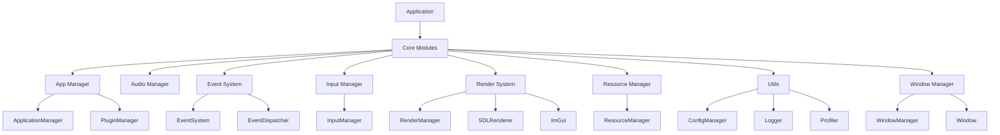

# DearTs Core 模块详细文档

## 概述

DearTs Core 是整个框架的核心部分，提供了应用程序开发所需的基础功能模块。这些模块包括应用管理、音频处理、事件系统、输入处理、设计模式、渲染系统、资源管理、工具类和窗口管理等。

## 模块详细说明

### 1. 应用管理 (app)

应用管理模块负责应用程序的生命周期管理，包括应用的初始化、运行和关闭。

#### 主要类和功能

- `ApplicationManager`：应用程序管理器，单例模式，负责应用程序的初始化和关闭。
- `Application`：应用程序基类，实现应用程序的基本功能。
- `PluginManager`：插件管理器，负责插件的加载、卸载和管理。
- `IApplication`：应用程序接口，定义应用程序的基本接口。
- `IPlugin`：插件接口，定义插件的基本接口。

#### 核心特性

- 应用程序生命周期管理
- 插件系统支持
- 应用配置管理
- 系统信息查询

### 2. 音频处理 (audio)

音频处理模块提供音频播放和管理功能。

#### 主要类和功能

- `AudioManager`：音频管理器，单例模式，负责音频系统的初始化和管理。
- 音频配置和统计信息结构体

#### 核心特性

- 音效和音乐播放
- 音量控制
- 音频资源管理
- 多通道音频支持

### 3. 事件系统 (events)

事件系统模块提供全局事件分发机制。

#### 主要类和功能

- `EventSystem`：事件系统管理器，单例模式，负责事件系统的初始化和管理。
- `EventDispatcher`：事件调度器，负责事件的订阅和分发。
- `Event`：基础事件类，所有事件类型的基类。
- `EventType`：事件类型枚举，定义各种事件类型。

#### 核心特性

- 全局事件分发
- 事件订阅和取消订阅
- 自定义事件支持
- 线程安全的事件处理

### 4. 输入处理 (input)

输入处理模块负责处理键盘和鼠标输入。

#### 主要类和功能

- `InputManager`：输入管理器，单例模式，负责输入系统的初始化和管理。
- `KeyCode`：键盘按键代码枚举
- `MouseButton`：鼠标按键代码枚举
- `Vector2`：2D向量结构体

#### 核心特性

- 键盘输入处理
- 鼠标输入处理
- 输入状态查询
- 鼠标位置和移动检测

### 5. 设计模式 (patterns)

设计模式模块提供常用的软件设计模式实现。

#### 主要类和功能

- `Singleton`：线程安全的单例模式基类
- `SingletonST`：单线程版本的单例模式基类
- `Manager`：管理器基类，继承自线程安全单例
- `ManagerST`：单线程版本的管理器基类

#### 核心特性

- 线程安全的单例模式实现
- CRTP（奇异递归模板模式）应用
- 简化的单例使用接口

### 6. 渲染系统 (render)

渲染系统模块提供跨平台的渲染功能。

#### 主要类和功能

- `RenderManager`：渲染管理器，单例模式，负责渲染系统的初始化和管理。
- `SDLRenderer`：基于SDL的渲染器实现
- `IRenderer`：渲染器接口
- `ITexture`：纹理接口
- `RenderContext`：渲染上下文

#### 核心特性

- 多种渲染器类型支持
- 纹理管理和渲染
- ImGui集成
- 渲染状态和配置管理
- 渲染统计信息

### 7. 资源管理 (resource)

资源管理模块负责应用程序资源的加载和管理。

#### 主要类和功能

- `ResourceManager`：资源管理器，单例模式，负责资源的加载和管理。
- `Resource`：基础资源类
- `TextureResource`：纹理资源类
- `SurfaceResource`：表面资源类

#### 核心特性

- 纹理资源加载和管理
- 表面资源加载和管理
- 资源缓存机制
- 自动资源释放

### 8. 工具类 (utils)

工具类模块提供各种实用工具函数和类。

#### 主要类和功能

- `ConfigManager`：配置管理器，负责应用程序配置的加载和保存。
- `Logger`：日志系统，提供多级别日志记录功能。
- `Profiler`：性能分析器，用于性能监控和分析。
- 文件和字符串工具函数

#### 核心特性

- 配置文件读写
- 多级别日志记录
- 性能分析和统计
- 文件操作工具
- 字符串处理工具

### 9. 窗口管理 (window)

窗口管理模块提供跨平台窗口管理功能。

#### 主要类和功能

- `WindowManager`：窗口管理器，单例模式，负责窗口的创建和管理。
- `Window`：窗口类，表示一个应用程序窗口。
- `WindowTitleBar`：窗口标题栏类
- `WindowRenderer`：窗口渲染器接口
- 窗口配置和信息结构体

#### 核心特性

- 多窗口管理
- 窗口状态控制（显示、隐藏、最大化、最小化等）
- 窗口事件处理
- 自定义窗口标题栏
- 显示器信息查询

## 核心架构关系



## 使用示例

### 初始化核心系统

```cpp
#include "core.h"

int main() {
    // 初始化核心系统
    if (!DearTs::Core::init()) {
        return -1;
    }
    
    // 获取各个管理器实例
    auto& appManager = DearTs::Core::Managers::app();
    auto& windowManager = DearTs::Core::Managers::window();
    auto& renderManager = DearTs::Core::Managers::render();
    
    // ... 应用程序逻辑 ...
    
    // 关闭核心系统
    DearTs::Core::shutdown();
    
    return 0;
}
```

### 创建和管理窗口

```cpp
#include "core/window/window_manager.h"

// 创建窗口配置
DearTs::Core::Window::WindowConfig config;
config.title = "My Application";
config.size = DearTs::Core::Window::WindowSize(1280, 720);

// 创建窗口
auto window = DEARTS_WINDOW_MANAGER().createWindow(config);

// 显示窗口
window->show();
```

### 使用事件系统

```cpp
#include "core/events/event_system.h"

// 订阅事件
EVENT_SYSTEM()->getDispatcher().subscribe(
    DearTs::Core::Events::EventType::EVT_WINDOW_CLOSE,
    [](const DearTs::Core::Events::Event& event) {
        // 处理窗口关闭事件
        return true;
    }
);
```

## 设计原则

1. **模块化设计**：每个模块都有明确的职责和接口
2. **单例模式**：核心管理器采用单例模式确保全局唯一实例
3. **接口抽象**：通过接口抽象实现解耦和可扩展性
4. **线程安全**：关键模块提供线程安全保证
5. **资源管理**：自动资源管理和释放机制
6. **配置驱动**：支持灵活的配置管理