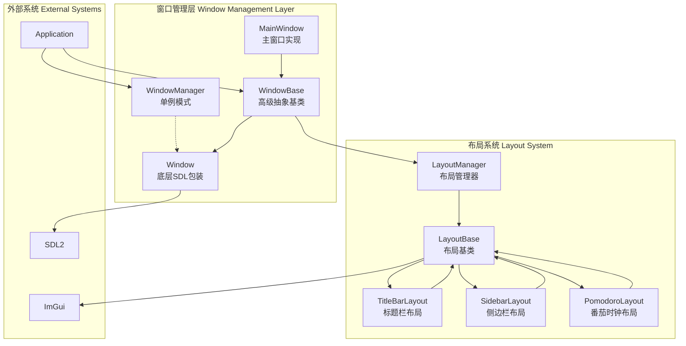
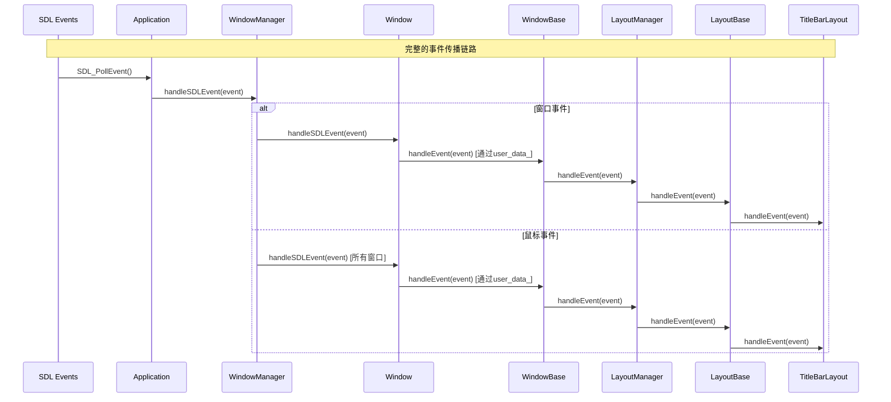
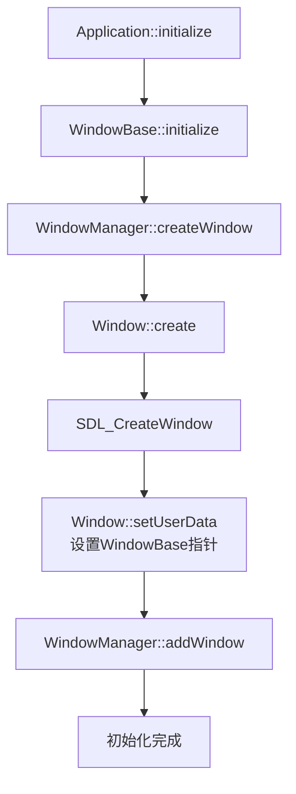
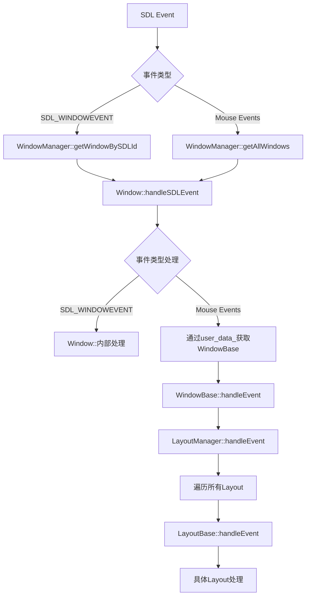
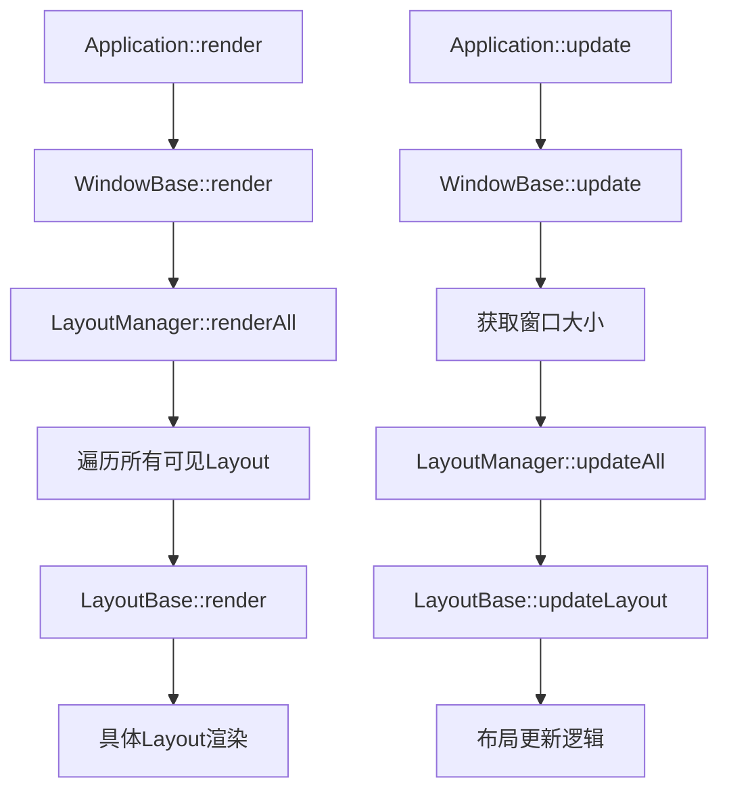
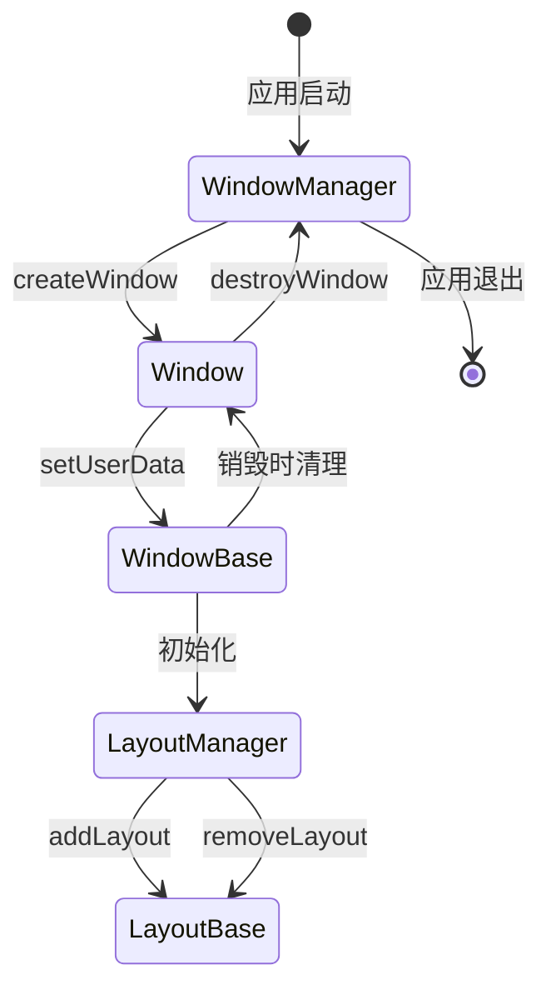

# DearTs Core Window 模块架构文档

## 概述

Core Window 模块是 DearTs 应用程序框架的核心窗口管理模块，采用分层架构设计，提供跨平台的窗口创建、管理、事件处理和布局系统。该模块基于 SDL2 和 ImGui 构建，实现了现代化的 GUI 应用程序架构。

## 架构概览

### 模块结构图

```
core/window/
├── window_manager.h/cpp          # 窗口管理器（单例）
├── window_base.h/cpp             # 窗口基类（高级抽象）
├── main_window.h/cpp             # 主窗口实现
├── layouts/                      # 布局系统
│   ├── layout_base.h/cpp         # 布局基类
│   ├── layout_manager.h/cpp      # 布局管理器（单例）
│   ├── title_bar_layout.h/cpp    # 标题栏布局
│   ├── sidebar_layout.h/cpp      # 侧边栏布局
│   └── pomodoro_layout.h/cpp     # 番茄时钟布局
└── README.md                     # 本文档
```

## 类关系架构

### 类层次结构图



### 类关系详解

### 1. WindowManager（窗口管理器）

**设计模式**: 单例模式
**职责**:
- 管理所有 Window 实例的生命周期
- 处理 SDL 事件分发
- 提供窗口创建和销毁的统一接口

**关键特性**:
- 线程安全的窗口管理
- SDL 事件到具体窗口的映射
- 窗口状态监控和批量操作

**代码示例**:
```cpp
// window_manager.h - 核心实现
class WindowManager {
public:
    static WindowManager& getInstance() {
        static WindowManager instance;
        return instance;
    }

    // 创建并添加窗口
    std::shared_ptr<Window> createWindow(const WindowConfig& config) {
        auto window = std::make_shared<Window>(config);
        if (window->create()) {
            addWindow(window);
            return window;
        }
        return nullptr;
    }

    // 事件分发 - 关键的事件处理入口
    void handleSDLEvent(const SDL_Event& event) {
        switch (event.type) {
            case SDL_WINDOWEVENT:
                handleWindowEvent(event);
                break;
            case SDL_MOUSEBUTTONDOWN:
            case SDL_MOUSEBUTTONUP:
            case SDL_MOUSEMOTION:
                handleMouseEvent(event);
                break;
        }
    }

private:
    std::unordered_map<uint32_t, std::shared_ptr<Window>> windows_;
    std::mutex windows_mutex_;
};
```

### 2. Window（底层窗口类）

**职责**:
- SDL 窗口的底层包装
- 原生 SDL 事件处理
- 窗口属性的直接操作

**关键特性**:
- 与 SDL 窗口的一对一映射
- 用户数据指针支持（用于关联 WindowBase）
- 渲染器集成支持

**代码示例**:
```cpp
// window.h - SDL窗口包装
class Window {
public:
    bool create() {
        sdl_window_ = SDL_CreateWindow(
            config_.title.c_str(),
            SDL_WINDOWPOS_CENTERED, SDL_WINDOWPOS_CENTERED,
            config_.width, config_.height,
            config_.flags
        );
        return sdl_window_ != nullptr;
    }

    // 设置用户数据 - 关键的关联机制
    void setUserData(void* user_data) {
        user_data_ = user_data;
    }

    // 获取关联的WindowBase
    template<typename T>
    T* getUserData() const {
        return static_cast<T*>(user_data_);
    }

    // SDL事件处理
    void handleSDLEvent(const SDL_Event& event) {
        if (event.type == SDL_WINDOWEVENT &&
            event.window.windowID == getWindowId()) {

            // 通过user_data_获取WindowBase
            if (auto* windowBase = getUserData<WindowBase>()) {
                windowBase->handleEvent(event);
            }
        }
    }

private:
    SDL_Window* sdl_window_ = nullptr;
    void* user_data_ = nullptr;  // 关键：关联WindowBase的指针
};
```

### 3. WindowBase（窗口基类）

**职责**:
- 高级窗口功能的抽象
- 布局系统的集成
- 事件处理的高级接口

**关键特性**:
- 通过组合模式包含 Window 实例
- 内置 LayoutManager 用于布局管理
- 模板方法模式支持子类定制

**代码示例**:
```cpp
// window_base.h - 高级窗口抽象
class WindowBase {
public:
    bool initialize() {
        // 创建底层Window
        window_ = WindowManager::getInstance().createWindow(getWindowConfig());
        if (!window_) return false;

        // 关键：设置关联指针
        window_->setUserData(this);

        // 初始化布局管理器
        layoutManager_.initialize(this);

        // 调用子类的初始化钩子
        return onInitialize();
    }

    // 事件处理 - 委托给布局管理器
    void handleEvent(const SDL_Event& event) {
        layoutManager_.handleEvent(event);
        onHandleEvent(event);
    }

    // 渲染 - 委托给布局管理器
    void render() {
        layoutManager_.renderAll();
        onRender();
    }

protected:
    virtual bool onInitialize() { return true; }
    virtual void onHandleEvent(const SDL_Event& event) {}
    virtual void onRender() {}

private:
    std::shared_ptr<Window> window_;           // 底层窗口
    LayoutManager layoutManager_;               // 布局管理器
};
```

### 4. MainWindow（主窗口实现）

**职责**:
- 应用程序主窗口的具体实现
- 特定布局的初始化和管理

**关键特性**:
- 继承自 WindowBase
- 预配置的布局组合（标题栏、侧边栏等）
- 应用程序特定的逻辑处理

**代码示例**:
```cpp
// main_window.h - 主窗口实现
class MainWindow : public WindowBase {
public:
    MainWindow(const std::string& title) : title_(title) {}

protected:
    bool onInitialize() override {
        // 添加标题栏布局
        auto titleBar = std::make_unique<TitleBarLayout>(title_);
        layoutManager_.addLayout("title_bar", std::move(titleBar));

        // 添加侧边栏布局
        auto sidebar = std::make_unique<SidebarLayout>();
        layoutManager_.addLayout("sidebar", std::move(sidebar));

        // 添加番茄时钟布局
        auto pomodoro = std::make_unique<PomodoroLayout>();
        layoutManager_.addLayout("pomodoro", std::move(pomodoro));

        return true;
    }

    void onRender() override {
        // 主窗口特定的渲染逻辑
        renderMainWindow();
    }

private:
    std::string title_;

    void renderMainWindow() {
        ImGuiViewport* viewport = ImGui::GetMainViewport();
        ImGui::SetNextWindowPos(viewport->WorkPos);
        ImGui::SetNextWindowSize(viewport->WorkSize);

        ImGui::Begin("Main Window", nullptr,
            ImGuiWindowFlags_NoDecoration | ImGuiWindowFlags_NoMove);

        // 主窗口内容渲染

        ImGui::End();
    }
};
```

### 5. LayoutManager（布局管理器）

**设计模式**: 单例模式、组合模式
**职责**:
- 管理多个布局对象
- 事件分发到各个布局
- 布局的生命周期管理

**关键特性**:
- 支持布局的动态添加和移除
- 统一的事件分发机制
- 布局可见性管理

**代码示例**:
```cpp
// layout_manager.h - 布局管理器
class LayoutManager {
public:
    void initialize(WindowBase* parent_window) {
        parent_window_ = parent_window;
    }

    // 添加布局
    void addLayout(const std::string& name, std::unique_ptr<LayoutBase> layout) {
        layout->setParentWindow(parent_window_);
        layouts_[name] = std::move(layout);
    }

    // 事件分发 - 关键的事件传播机制
    void handleEvent(const SDL_Event& event) {
        for (auto& [name, layout] : layouts_) {
            if (layout->isVisible()) {
                layout->handleEvent(event);
            }
        }
    }

    // 渲染所有可见布局
    void renderAll() {
        for (auto& [name, layout] : layouts_) {
            if (layout->isVisible()) {
                layout->render();
            }
        }
    }

private:
    WindowBase* parent_window_ = nullptr;
    std::unordered_map<std::string, std::unique_ptr<LayoutBase>> layouts_;
};
```

### 6. LayoutBase（布局基类）

**职责**:
- 定义布局接口
- 提供布局的基础功能

**关键特性**:
- 纯虚函数定义标准接口
- 父窗口引用支持
- 位置和大小管理

**代码示例**:
```cpp
// layout_base.h - 布局基类
class LayoutBase {
public:
    virtual ~LayoutBase() = default;

    // 纯虚函数接口
    virtual void render() = 0;
    virtual void handleEvent(const SDL_Event& event) = 0;
    virtual void updateLayout() = 0;

    // 基础功能
    void setParentWindow(WindowBase* window) { parent_window_ = window; }
    void setVisible(bool visible) { visible_ = visible; }
    bool isVisible() const { return visible_; }

    // 位置和大小管理
    void setPosition(int x, int y) { x_ = x; y_ = y; }
    void setSize(int width, int height) { width_ = width; height_ = height; }

protected:
    WindowBase* parent_window_ = nullptr;
    bool visible_ = true;
    int x_ = 0, y_ = 0;
    int width_ = 0, height_ = 0;
};

// 具体布局实现示例 - TitleBarLayout
class TitleBarLayout : public LayoutBase {
public:
    TitleBarLayout(const std::string& title) : title_(title) {}

    void render() override {
        ImGui::SetNextWindowPos(ImVec2(0, 0));
        ImGui::SetNextWindowSize(ImVec2(ImGui::GetMainViewport()->Size.x, 40));

        ImGui::Begin("TitleBar", nullptr,
            ImGuiWindowFlags_NoDecoration | ImGuiWindowFlags_NoMove);

        // 渲染标题
        ImGui::Text(title_.c_str());

        // 渲染控制按钮
        renderControlButtons();

        ImGui::End();
    }

    void handleEvent(const SDL_Event& event) override {
        switch (event.type) {
            case SDL_MOUSEBUTTONDOWN:
                if (event.button.button == SDL_BUTTON_LEFT) {
                    handleMouseClick(event.button.x, event.button.y);
                }
                break;
        }
    }

private:
    std::string title_;

    void renderControlButtons() {
        ImGui::SameLine(ImGui::GetWindowWidth() - 120);

        if (ImGui::Button("最小化")) {
            // 最小化逻辑
        }

        ImGui::SameLine();
        if (ImGui::Button("关闭")) {
            if (parent_window_) {
                parent_window_->close();
            }
        }
    }
};
```

## 通信机制和事件流

### 事件传播链路图



### 事件传播代码实现

```cpp
// 1. Application层 - 事件轮询
void GUIApplication::processSDLEvents() {
    SDL_Event event;
    while (SDL_PollEvent(&event)) {
        // 转发所有事件给窗口管理器
        WindowManager::getInstance().handleSDLEvent(event);

        // 处理应用程序级别事件
        if (event.type == SDL_QUIT) {
            requestExit();
        }
    }
}

// 2. WindowManager层 - 事件分发
void WindowManager::handleSDLEvent(const SDL_Event& event) {
    switch (event.type) {
        case SDL_WINDOWEVENT:
            // 窗口事件 - 精确匹配
            handleWindowEvent(event);
            break;

        case SDL_MOUSEBUTTONDOWN:
        case SDL_MOUSEBUTTONUP:
        case SDL_MOUSEMOTION:
            // 鼠标事件 - 广播给所有窗口
            handleMouseEvent(event);
            break;
    }
}

void WindowManager::handleWindowEvent(const SDL_Event& event) {
    auto window = getWindowBySDLId(event.window.windowID);
    if (window) {
        window->handleSDLEvent(event);
    }
}

void WindowManager::handleMouseEvent(const SDL_Event& event) {
    // 鼠标事件广播给所有窗口
    for (auto& [id, window] : windows_) {
        window->handleSDLEvent(event);
    }
}

// 3. Window层 - 用户数据指针转换
void Window::handleSDLEvent(const SDL_Event& event) {
    if (event.type == SDL_WINDOWEVENT &&
        event.window.windowID == getWindowId()) {

        // 关键：通过user_data_获取WindowBase
        if (auto* windowBase = getUserData<WindowBase>()) {
            windowBase->handleEvent(event);
        }
    }

    // 鼠标事件也需要处理
    if (event.type == SDL_MOUSEBUTTONDOWN ||
        event.type == SDL_MOUSEBUTTONUP ||
        event.type == SDL_MOUSEMOTION) {

        if (auto* windowBase = getUserData<WindowBase>()) {
            windowBase->handleEvent(event);
        }
    }
}

// 4. WindowBase层 - 事件委托
void WindowBase::handleEvent(const SDL_Event& event) {
    // 委托给布局管理器处理
    layoutManager_.handleEvent(event);

    // 调用子类的特定处理
    onHandleEvent(event);
}

// 5. LayoutManager层 - 事件遍历分发
void LayoutManager::handleEvent(const SDL_Event& event) {
    // 遍历所有布局，分发给可见的布局
    for (auto& [name, layout] : layouts_) {
        if (layout->isVisible()) {
            layout->handleEvent(event);
        }
    }
}

// 6. LayoutBase层 - 具体事件处理
void TitleBarLayout::handleEvent(const SDL_Event& event) {
    switch (event.type) {
        case SDL_MOUSEBUTTONDOWN:
            if (event.button.button == SDL_BUTTON_LEFT) {
                // 检查鼠标是否在关闭按钮区域
                if (isPointInCloseButton(event.button.x, event.button.y)) {
                    if (parent_window_) {
                        parent_window_->close();
                    }
                }
                // 检查鼠标是否在标题栏区域（用于拖拽）
                else if (isPointInTitleBar(event.button.x, event.button.y)) {
                    startDragging(event.button.x, event.button.y);
                }
            }
            break;

        case SDL_MOUSEBUTTONUP:
            if (event.button.button == SDL_BUTTON_LEFT) {
                stopDragging();
            }
            break;

        case SDL_MOUSEMOTION:
            if (isDragging()) {
                updateWindowPosition(event.motion.x, event.motion.y);
            }
            break;
    }
}
```

### 函数调用链详解

#### 1. 窗口初始化链路



**窗口初始化代码实现**:
```cpp
// 1. Application层创建主窗口
void GUIApplication::initializeSDL() {
    // 创建主窗口对象
    mainWindow_ = std::make_unique<MainWindow>("DearTs GUI Application");

    // 初始化窗口（触发整个初始化链）
    if (!mainWindow_->initialize()) {
        throw std::runtime_error("Main window initialization failed");
    }

    // 添加到窗口管理器
    WindowManager::getInstance().addWindow(mainWindow_->getWindow());
}

// 2. WindowBase层初始化
bool WindowBase::initialize() {
    // 创建底层Window
    window_ = WindowManager::getInstance().createWindow(getWindowConfig());
    if (!window_) return false;

    // 关键：设置user_data_指针，建立Window与WindowBase的关联
    window_->setUserData(this);

    // 初始化布局管理器
    layoutManager_.initialize(this);

    // 调用子类的初始化钩子（模板方法模式）
    return onInitialize();
}

// 3. MainWindow子类初始化
bool MainWindow::onInitialize() {
    // 添加各种布局
    auto titleBar = std::make_unique<TitleBarLayout>(title_);
    layoutManager_.addLayout("title_bar", std::move(titleBar));

    auto sidebar = std::make_unique<SidebarLayout>();
    layoutManager_.addLayout("sidebar", std::move(sidebar));

    return true;
}
```

#### 2. 事件处理链路



#### 3. 渲染链路



**渲染链路代码实现**:
```cpp
// 1. Application层渲染
void GUIApplication::render() {
    // 清屏
    SDL_SetRenderDrawColor(m_renderer, 0, 0, 0, 255);
    SDL_RenderClear(m_renderer);

    // 开始新帧
    ImGui_ImplSDLRenderer2_NewFrame();
    ImGui_ImplSDL2_NewFrame();
    ImGui::NewFrame();

    // 渲染主窗口
    if (mainWindow_) {
        mainWindow_->render();
    }

    // 结束帧并呈现
    ImGui::Render();
    ImGui_ImplSDLRenderer2_RenderDrawData(ImGui::GetDrawData(), m_renderer);
    SDL_RenderPresent(m_renderer);
}

// 2. WindowBase层渲染
void WindowBase::render() {
    // 委托给布局管理器渲染所有布局
    layoutManager_.renderAll();

    // 调用子类的特定渲染
    onRender();
}

// 3. LayoutManager层渲染
void LayoutManager::renderAll() {
    // 遍历所有布局，只渲染可见的布局
    for (auto& [name, layout] : layouts_) {
        if (layout->isVisible()) {
            layout->render();
        }
    }
}

// 4. 具体布局渲染
void TitleBarLayout::render() {
    // 设置标题栏位置和大小
    ImGui::SetNextWindowPos(ImVec2(0, 0));
    ImGui::SetNextWindowSize(ImVec2(ImGui::GetMainViewport()->Size.x, 40));

    // 开始渲染标题栏窗口
    ImGui::Begin("TitleBar", nullptr,
        ImGuiWindowFlags_NoDecoration | ImGuiWindowFlags_NoMove);

    // 渲染标题文本
    ImGui::Text(title_.c_str());

    // 渲染控制按钮
    renderControlButtons();

    ImGui::End();
}
```

## 关键设计模式应用

### 1. 单例模式（Singleton Pattern）
- **应用类**: WindowManager, LayoutManager
- **目的**: 确保全局唯一实例，提供统一的访问点
- **实现**: 静态局部变量 + 私有构造函数

### 2. 组合模式（Composite Pattern）
- **应用**: WindowBase 包含 Window，LayoutManager 包含多个 Layout
- **目的**: 统一处理单个组件和组合组件
- **优势**: 支持递归结构和统一接口

### 3. 适配器模式（Adapter Pattern）
- **应用**: Window 适配 SDL 窗口 API
- **目的**: 将底层 SDL 接口适配为高级接口
- **实现**: 通过 user_data_ 指针关联高层抽象

### 4. 模板方法模式（Template Method Pattern）
- **应用**: WindowBase 的生命周期方法
- **目的**: 定义算法骨架，子类实现具体步骤
- **方法**: `initialize()`, `render()`, `update()`, `handleEvent()`

### 5. 观察者模式（Observer Pattern）
- **应用**: 事件分发机制
- **目的**: 实现松耦合的事件通信
- **实现**: 通过接口回调实现

## 内存管理和生命周期

### 对象生命周期图



### 内存管理策略
1. **智能指针**: 使用 `std::shared_ptr<Window>` 管理窗口对象
2. **RAII原则**: 通过析构函数确保资源释放
3. **用户数据指针**: Window 通过 `user_data_` 关联 WindowBase，不负责内存管理
4. **布局管理**: LayoutManager 使用 `std::unique_ptr<LayoutBase>` 管理布局对象

## 关键特性和技术要点

### 1. 双层窗口架构
- **底层**: Window 类处理 SDL 相关的低级操作
- **高层**: WindowBase 提供面向应用的高级接口
- **关联**: 通过 `user_data_` 指针建立双向关联

### 2. 事件过滤和分发
- **WindowManager**: 根据事件类型选择目标窗口
- **鼠标事件**: 广播给所有窗口，由各窗口自行处理
- **窗口事件**: 精确匹配到具体窗口

### 3. 布局系统集成
- **统一管理**: LayoutManager 统一管理所有布局
- **事件分发**: 支持事件向所有可见布局的分发
- **独立更新**: 每个布局可以独立更新和渲染

### 4. 线程安全
- **互斥锁**: WindowManager 使用 `windows_mutex_` 保护窗口映射
- **原子操作**: 使用 `std::atomic` 确保状态同步

## 常见使用场景

### 1. 创建主窗口

```cpp
// 方法一：直接创建MainWindow
auto mainWindow = std::make_unique<MainWindow>("My Application");
if (!mainWindow->initialize()) {
    std::cerr << "Failed to initialize main window" << std::endl;
    return -1;
}

// 添加到窗口管理器
WindowManager::getInstance().addWindow(mainWindow->getWindow());

// 方法二：通过WindowManager创建
WindowConfig config;
config.title = "My Application";
config.width = 1280;
config.height = 720;
config.flags = SDL_WINDOW_RESIZABLE | SDL_WINDOW_BORDERLESS;

auto window = WindowManager::getInstance().createWindow(config);
if (!window) {
    std::cerr << "Failed to create window" << std::endl;
    return -1;
}

// 创建WindowBase并关联
auto windowBase = std::make_unique<MainWindow>("My Application");
windowBase->setWindow(window);
window->setUserData(windowBase.get());
```

### 2. 添加自定义布局

```cpp
// 在WindowBase子类中添加布局
void CustomWindow::onInitialize() {
    WindowBase::onInitialize();

    // 添加标题栏布局
    auto titleBar = std::make_unique<TitleBarLayout>("Custom Application");
    titleBar->setPosition(0, 0);
    titleBar->setSize(getWidth(), 40);
    layoutManager_.addLayout("title_bar", std::move(titleBar));

    // 添加自定义内容布局
    auto contentLayout = std::make_unique<CustomContentLayout>();
    contentLayout->setPosition(0, 40);
    contentLayout->setSize(getWidth(), getHeight() - 40);
    layoutManager_.addLayout("content", std::move(contentLayout));

    // 添加状态栏布局
    auto statusBar = std::make_unique<StatusBarLayout>();
    statusBar->setPosition(0, getHeight() - 20);
    statusBar->setSize(getWidth(), 20);
    layoutManager_.addLayout("status_bar", std::move(statusBar));
}

// 动态添加和移除布局
void CustomWindow::addSidebar(bool show) {
    if (show) {
        auto sidebar = std::make_unique<SidebarLayout>();
        sidebar->setPosition(0, 40);
        sidebar->setSize(200, getHeight() - 60);
        layoutManager_.addLayout("sidebar", std::move(sidebar));

        // 调整内容区域位置
        auto content = layoutManager_.getLayout("content");
        if (content) {
            content->setPosition(200, 40);
            content->setSize(getWidth() - 200, getHeight() - 60);
        }
    } else {
        layoutManager_.removeLayout("sidebar");

        // 恢复内容区域位置
        auto content = layoutManager_.getLayout("content");
        if (content) {
            content->setPosition(0, 40);
            content->setSize(getWidth(), getHeight() - 60);
        }
    }
}
```

### 3. 事件处理

```cpp
// 在具体布局中处理事件
class CustomContentLayout : public LayoutBase {
public:
    void handleEvent(const SDL_Event& event) override {
        switch (event.type) {
            case SDL_MOUSEBUTTONDOWN:
                if (event.button.button == SDL_BUTTON_LEFT) {
                    // 处理鼠标左键点击
                    handleClick(event.button.x, event.button.y);
                } else if (event.button.button == SDL_BUTTON_RIGHT) {
                    // 处理鼠标右键点击
                    showContextMenu(event.button.x, event.button.y);
                }
                break;

            case SDL_MOUSEMOTION:
                // 处理鼠标移动
                handleMouseMove(event.motion.x, event.motion.y);
                break;

            case SDL_KEYDOWN:
                // 处理键盘事件
                handleKeyPress(event.key.keysym.sym, event.key.keysym.mod);
                break;

            case SDL_MOUSEWHEEL:
                // 处理鼠标滚轮
                handleMouseWheel(event.wheel.y);
                break;
        }
    }

private:
    void handleClick(int x, int y) {
        // 检查点击位置
        if (isPointInButton(x, y)) {
            onButtonClicked();
        } else if (isPointInTextArea(x, y)) {
            onTextAreaClicked(x, y);
        }
    }

    void handleKeyPress(SDL_Keycode key, Uint16 mod) {
        if (key == SDLK_ESCAPE) {
            // ESC键处理
            if (parent_window_) {
                parent_window_->close();
            }
        } else if (key == SDLK_SPACE && (mod & KMOD_CTRL)) {
            // Ctrl+Space 处理
            onCtrlSpacePressed();
        }
    }
};

// 窗口级别的事件处理
class MainWindow : public WindowBase {
protected:
    void onHandleEvent(const SDL_Event& event) override {
        switch (event.type) {
            case SDL_KEYDOWN:
                if (event.key.keysym.sym == SDLK_F11) {
                    // F11全屏切换
                    toggleFullscreen();
                } else if (event.key.keysym.sym == SDLK_F5) {
                    // F5刷新
                    refreshContent();
                }
                break;

            case SDL_WINDOWEVENT:
                if (event.window.event == SDL_WINDOWEVENT_RESIZED) {
                    // 窗口大小改变
                    onWindowResized(event.window.data1, event.window.data2);
                }
                break;
        }
    }

private:
    void toggleFullscreen() {
        if (window_) {
            bool isFullscreen = SDL_GetWindowFlags(window_->getSDLWindow()) & SDL_WINDOW_FULLSCREEN;
            SDL_SetWindowFullscreen(window_->getSDLWindow(),
                isFullscreen ? 0 : SDL_WINDOW_FULLSCREEN_DESKTOP);
        }
    }

    void onWindowResized(int newWidth, int newHeight) {
        // 通知所有布局窗口大小改变
        layoutManager_.updateLayouts(newWidth, newHeight);
    }
};
```

### 4. 布局管理和渲染

```cpp
// 自定义布局的完整实现
class DashboardLayout : public LayoutBase {
public:
    DashboardLayout() {
        // 初始化数据
        metrics_ = {
            {"CPU", 45.0f},
            {"Memory", 67.8f},
            {"GPU", 23.1f},
            {"Disk", 89.4f}
        };
    }

    void render() override {
        ImGui::SetNextWindowPos(ImVec2(x_, y_));
        ImGui::SetNextWindowSize(ImVec2(width_, height_));

        if (ImGui::Begin("Dashboard", nullptr,
            ImGuiWindowFlags_NoMove | ImGuiWindowFlags_NoResize)) {

            // 渲染标题
            ImGui::Text("System Metrics");
            ImGui::Separator();

            // 渲染性能指标
            renderMetrics();

            // 渲染图表
            renderCharts();

            // 渲染控制按钮
            renderControls();
        }
        ImGui::End();
    }

    void updateLayout() override {
        // 更新数据
        updateMetrics();
    }

private:
    std::unordered_map<std::string, float> metrics_;

    void renderMetrics() {
        int i = 0;
        for (const auto& [name, value] : metrics_) {
            ImGui::PushID(i++);

            // 进度条
            ImGui::Text("%s", name.c_str());
            ImGui::SameLine(100);
            ImGui::ProgressBar(value / 100.0f, ImVec2(200, 15));
            ImGui::SameLine(310);
            ImGui::Text("%.1f%%", value);

            ImGui::PopID();
        }
    }

    void renderCharts() {
        // 简单的文本图表
        ImGui::Text("Performance Chart:");

        for (int i = 0; i < 50; ++i) {
            float value = sin(i * 0.2f) * 0.5f + 0.5f; // 模拟数据
            ImGui::SameLine();
            ImGui::Text("█");
            if (value > 0.7f) ImGui::TextColored(ImVec4(1, 0, 0, 1), "█");
            else if (value > 0.4f) ImGui::TextColored(ImVec4(1, 1, 0, 1), "█");
            else ImGui::TextColored(ImVec4(0, 1, 0, 1), "█");
        }
    }

    void renderControls() {
        ImGui::Separator();

        if (ImGui::Button("Refresh")) {
            updateMetrics();
        }

        ImGui::SameLine();
        if (ImGui::Button("Export")) {
            exportMetrics();
        }

        ImGui::SameLine();
        if (ImGui::Button("Settings")) {
            showSettings = !showSettings;
        }
    }

    void updateMetrics() {
        // 模拟数据更新
        for (auto& [name, value] : metrics_) {
            value += (rand() % 21 - 10) * 0.1f; // -1.0 到 1.0 的随机变化
            value = std::max(0.0f, std::min(100.0f, value)); // 限制在0-100范围内
        }
    }

    bool showSettings = false;
};
```

## 完整示例：自定义窗口应用

下面是一个完整的使用示例，展示如何创建一个带有自定义功能的应用程序：

```cpp
#include "core/window/window_manager.h"
#include "core/window/window_base.h"
#include "core/window/layouts/layout_base.h"
#include "core/window/layouts/layout_manager.h"
#include "core/window/main_window.h"

// 自定义布局：任务管理器
class TaskManagerLayout : public LayoutBase {
public:
    TaskManagerLayout() {
        tasks_ = {
            {"完成项目文档", false},
            {"代码审查", true},
            {"团队会议", false},
            {"性能优化", false}
        };
    }

    void render() override {
        ImGui::SetNextWindowPos(ImVec2(x_, y_));
        ImGui::SetNextWindowSize(ImVec2(width_, height_));

        if (ImGui::Begin("Task Manager", nullptr,
            ImGuiWindowFlags_NoMove | ImGuiWindowFlags_NoResize)) {

            ImGui::Text("今日任务");
            ImGui::Separator();

            // 渲染任务列表
            for (size_t i = 0; i < tasks_.size(); ++i) {
                ImGui::PushID(i);

                bool completed = tasks_[i].second;
                if (ImGui::Checkbox(tasks_[i].first.c_str(), &completed)) {
                    tasks_[i].second = completed;
                }

                ImGui::PopID();
            }

            ImGui::Separator();

            // 添加新任务
            static char newTask[256] = "";
            ImGui::InputText("New Task", newTask, sizeof(newTask));
            ImGui::SameLine();
            if (ImGui::Button("Add")) {
                if (strlen(newTask) > 0) {
                    tasks_.emplace_back(newTask, false);
                    memset(newTask, 0, sizeof(newTask));
                }
            }

            // 统计信息
            int completed = std::count_if(tasks_.begin(), tasks_.end(),
                [](const auto& task) { return task.second; });
            ImGui::Text("Progress: %d/%d completed (%.1f%%)",
                completed, (int)tasks_.size(),
                (float)completed / tasks_.size() * 100.0f);
        }
        ImGui::End();
    }

    void handleEvent(const SDL_Event& event) override {
        // 可以处理快捷键等
        if (event.type == SDL_KEYDOWN) {
            if (event.key.keysym.sym == SDLK_DELETE) {
                // Delete键删除最后一个任务
                if (!tasks_.empty()) {
                    tasks_.pop_back();
                }
            }
        }
    }

    void updateLayout() override {
        // 定期更新数据
    }

private:
    std::vector<std::pair<std::string, bool>> tasks_;
};

// 自定义窗口类
class ProductivityWindow : public WindowBase {
public:
    ProductivityWindow() : WindowBase() {}

protected:
    bool onInitialize() override {
        // 添加标题栏
        auto titleBar = std::make_unique<TitleBarLayout>("Productivity App");
        layoutManager_.addLayout("title_bar", std::move(titleBar));

        // 添加任务管理器
        auto taskManager = std::make_unique<TaskManagerLayout>();
        taskManager->setPosition(0, 40);
        taskManager->setSize(400, 300);
        layoutManager_.addLayout("task_manager", std::move(taskManager));

        return true;
    }

    void onHandleEvent(const SDL_Event& event) override {
        // 处理窗口级快捷键
        if (event.type == SDL_KEYDOWN) {
            switch (event.key.keysym.sym) {
                case SDLK_n:
                    if (event.key.keysym.mod & KMOD_CTRL) {
                        // Ctrl+N: 新建任务
                        focusTaskManager();
                    }
                    break;
                case SDLK_q:
                    if (event.key.keysym.mod & KMOD_CTRL) {
                        // Ctrl+Q: 退出
                        close();
                    }
                    break;
            }
        }
    }

    void onRender() override {
        // 渲染主窗口内容
        renderMainWindow();
    }

private:
    void renderMainWindow() {
        ImGuiViewport* viewport = ImGui::GetMainViewport();
        ImGui::SetNextWindowPos(ImVec2(0, 40));
        ImGui::SetNextWindowSize(ImVec2(viewport->Size.x, viewport->Size.y - 40));

        ImGui::Begin("Main Content", nullptr,
            ImGuiWindowFlags_NoDecoration | ImGuiWindowFlags_NoMove);

        ImGui::Text("欢迎使用生产力应用程序！");
        ImGui::Text("使用 Ctrl+N 快速添加任务");

        ImGui::End();
    }

    void focusTaskManager() {
        auto taskManager = layoutManager_.getLayout("task_manager");
        if (taskManager) {
            taskManager->setVisible(true);
        }
    }
};

// 主程序入口
int main() {
    // 初始化SDL和ImGui
    if (SDL_Init(SDL_INIT_VIDEO) < 0) {
        std::cerr << "SDL initialization failed" << std::endl;
        return -1;
    }

    // 创建窗口
    SDL_Window* window = SDL_CreateWindow(
        "Productivity App",
        SDL_WINDOWPOS_CENTERED, SDL_WINDOWPOS_CENTERED,
        800, 600,
        SDL_WINDOW_BORDERLESS | SDL_WINDOW_RESIZABLE
    );

    SDL_Renderer* renderer = SDL_CreateRenderer(window, -1,
        SDL_RENDERER_PRESENTVSYNC | SDL_RENDERER_ACCELERATED);

    // 初始化ImGui
    IMGUI_CHECKVERSION();
    ImGui::CreateContext();
    ImGui_ImplSDL2_InitForSDLRenderer(window, renderer);
    ImGui_ImplSDLRenderer2_Init(renderer);

    // 创建应用程序窗口
    auto appWindow = std::make_unique<ProductivityWindow>();
    if (!appWindow->initialize()) {
        std::cerr << "Failed to initialize app window" << std::endl;
        return -1;
    }

    // 创建底层Window并关联
    WindowConfig config;
    config.title = "Productivity App";
    config.width = 800;
    config.height = 600;
    auto nativeWindow = WindowManager::getInstance().createWindow(config);
    nativeWindow->setUserData(appWindow.get());
    appWindow->setWindow(nativeWindow);

    // 主循环
    bool running = true;
    while (running) {
        SDL_Event event;
        while (SDL_PollEvent(&event)) {
            ImGui_ImplSDL2_ProcessEvent(&event);

            if (event.type == SDL_QUIT) {
                running = false;
            } else {
                // 处理窗口事件
                WindowManager::getInstance().handleSDLEvent(event);
            }
        }

        // 渲染
        SDL_SetRenderDrawColor(renderer, 0, 0, 0, 255);
        SDL_RenderClear(renderer);

        ImGui_ImplSDLRenderer2_NewFrame();
        ImGui_ImplSDL2_NewFrame();
        ImGui::NewFrame();

        // 渲染应用程序窗口
        appWindow->render();

        ImGui::Render();
        ImGui_ImplSDLRenderer2_RenderDrawData(ImGui::GetDrawData(), renderer);
        SDL_RenderPresent(renderer);
    }

    // 清理
    ImGui_ImplSDLRenderer2_Shutdown();
    ImGui_ImplSDL2_Shutdown();
    ImGui::DestroyContext();
    SDL_DestroyRenderer(renderer);
    SDL_DestroyWindow(window);
    SDL_Quit();

    return 0;
}
```

这个完整的示例展示了：
1. 如何创建自定义布局类
2. 如何实现一个完整的应用程序窗口
3. 如何处理用户交互和快捷键
4. 如何集成整个窗口系统
5. 实际的项目结构和最佳实践

通过这个示例，开发者可以清楚地理解如何使用DearTs的窗口系统来构建实际的应用程序。

## 扩展指南

### 1. 添加新的布局类型
1. 继承 `LayoutBase` 类
2. 实现纯虚函数：`render()`, `updateLayout()`, `handleEvent()`
3. 在具体窗口中通过 `LayoutManager::addLayout()` 添加

### 2. 自定义窗口类型
1. 继承 `WindowBase` 类
2. 重写 `initialize()`, `render()`, `update()`, `handleEvent()`
3. 在构造函数中配置窗口属性

### 3. 事件处理扩展
1. 在 `Window::handleSDLEvent()` 中添加新的事件类型处理
2. 在具体布局中实现相应的处理逻辑

## 性能优化建议

1. **事件过滤**: 在 WindowManager 层面过滤不必要的事件
2. **布局裁剪**: 只渲染可见区域内的布局
3. **智能更新**: 只在内容变化时更新布局
4. **内存池**: 对于频繁创建销毁的对象使用内存池

## 总结

Core Window 模块通过清晰的分层架构和设计模式，实现了一个功能强大、易于扩展的窗口管理系统。关键特点包括：

1. **清晰的职责分离**: 底层 SDL 操作与高级应用逻辑分离
2. **灵活的事件系统**: 支持事件的精确分发和处理
3. **可扩展的布局系统**: 支持动态添加和管理布局组件
4. **现代 C++ 特性**: 充分利用智能指针、RAII 等特性确保安全性

这个架构为构建复杂的桌面应用程序提供了坚实的基础，同时保持了代码的可读性和可维护性。