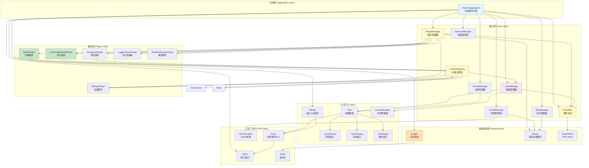

# DearTs Framework 架构总览

> 基于 SDL3 + ImGui 的现代 C++20 应用框架

## 整体架构图



## 目录结构

```
DearTsd/
├── core/                      # 核心系统
│   ├── app/                   # 应用生命周期
│   │   ├── application.h/cpp  # Application 基类
│   │   └── application_state  # 应用状态枚举
│   ├── event/                 # 事件系统
│   │   ├── event_bus.h/cpp    # 类型安全事件总线
│   │   └── events.h           # 预定义事件
│   ├── plugin/                # 插件系统
│   │   ├── plugin.h/cpp       # IPlugin 接口和 PluginManager
│   │   └── plugin_wrapper.h   # 插件包装类
│   ├── content/               # 内容注册表
│   │   ├── registry_base.h    # 基础定义
│   │   ├── commands.h/cpp     # 命令注册
│   │   ├── tools.h/cpp        # 工具注册
│   │   ├── settings.h/cpp     # 设置注册
│   │   └── callbacks.h/cpp    # 回调管理
│   ├── ui/                    # UI 系统
│   │   ├── view.h/cpp         # View 基类和视图类型
│   │   ├── view_manager.h/cpp # ViewManager
│   │   ├── theme_manager.h/cpp# ThemeManager
│   │   ├── shortcut_manager.h/cpp# ShortcutManager
│   │   ├── layout_manager.h/cpp# LayoutManager
│   │   ├── title_bar.h/cpp    # 自定义标题栏
│   │   ├── imgui_layer.h/cpp  # ImGui 集成层
│   │   └── task_widget.h/cpp  # 任务进度控件
│   ├── tasks/                 # 任务管理
│   │   ├── task_manager.h/cpp # TaskManager
│   │   └── task.h/cpp         # Task 类
│   ├── config/                # 配置管理
│   │   ├── config_manager.h/cpp# ConfigManager
│   │   └── imgui_user_config.h# ImGui 配置
│   └── utils/                 # 工具类
│       ├── file_dialog.hpp    # 文件对话框
│       └── result.h           # Result<T,E> 类型
│
├── lib/                       # 库文件
│   └── liblogger/             # 日志库
│       └── logger.h/cpp       # Logger 实现
│
├── main/                      # 主程序
│   └── gui/                   # GUI 应用
│       ├── include/
│       │   └── dearts_application.hpp
│       └── source/
│           ├── main.cpp       # 入口函数
│           └── dearts_application.cpp
│
├── plugins/                   # 插件实现
│   ├── builtin/               # 内置插件
│   │   ├── include/
│   │   │   ├── builtin_plugin.hpp
│   │   │   └── views/         # 视图实现
│   │   │       ├── hello_world_view.hpp
│   │   │       └── data_inspector_view.hpp
│   │   └── source/
│   │       └── builtin_plugin.cpp
│   ├── command_palette/       # 命令面板插件
│   ├── settings/              # 设置插件
│   ├── navigation/            # 导航插件
│   ├── logger_viewer/         # 日志查看器插件
│   └── toast_notification/    # Toast 通知插件
│
├── third_party/               # 第三方库
│   ├── SDL/                   # SDL3
│   ├── imgui/                 # ImGui
│   ├── json/                  # nlohmann/json
│   └── fmt/                   # fmtlib
│
├── resources/                 # 资源文件
│   └── fonts/                 # 字体文件
│
├── docs/                      # 文档
│   ├── 01-架构总览.md         # 本文档
│   ├── 02-核心组件.md         # 核心组件说明
│   ├── 03-事件系统.md         # 事件系统说明
│   ├── 04-UI系统.md           # UI 系统说明
│   ├── 05-插件开发指南.md     # 插件开发指南
│   └── diagrams/              # 架构图
│
└── CMakeLists.txt             # CMake 配置
```

## 技术栈

### 核心技术

| 技术 | 版本 | 用途 |
|------|------|------|
| C++ | C++20 | 编程语言 |
| CMake | 3.20+ | 构建系统 |
| SDL3 | Latest | 窗口管理和输入处理 |
| ImGui | 2.13.3+ | 即时模式 GUI |
| nlohmann/json | 3.11+ | JSON 处理 |
| fmtlib | 10.0+ | 字符串格式化 |

### C++20 特性应用

| 特性 | 应用场景 |
|------|----------|
| Concepts | 类型约束（std::derived_from<View>） |
| Ranges | 容器操作 |
| std::format | 字符串格式化 |
| std::variant | ConfigValue 类型安全 |
| std::atomic | 线程安全 |
| constexpr | 编译期常量 |
| std::filesystem | 路径处理 |
| coroutines (future) | 异步任务 |

## 设计理念

### 1. 插件优先架构

所有功能通过插件实现，核心框架只提供基础设施：

```cpp
// 核心不包含具体功能
class DearTsApplication : public Application {
    // 只负责初始化和协调
};

// 所有功能由插件提供
class MyPlugin : public IPlugin {
    Result<void, std::string> on_load() override {
        // 注册视图、命令、工具
        ContentRegistry::Views::add<MyView>();
        ContentRegistry::Commands::add("action", "Action", []() { ... });
        return Result::ok();
    }
};
```

### 2. 事件驱动设计

模块间通过事件总线解耦：

```cpp
// 发布事件
EventBus::instance().publish(DataModifiedEvent{ offset, size });

// 订阅事件（RAII 自动取消）
EventBus::Token token = EventBus::instance().subscribe<DataModifiedEvent>(
    [](const DataModifiedEvent& e) {
        // 处理事件
    }
);
// token 析构时自动取消订阅
```

### 3. 类型安全

使用现代 C++ 特性确保类型安全：

```cpp
// Result<T, E> 替代异常
Result<Data, std::string> load() {
    if (error) return Result::err("Failed");
    return Result::ok(data);
}

// std::variant 类型安全的配置值
using ConfigValue = std::variant<bool, int, double, std::string>;

// Concepts 约束模板参数
template<std::derived_from<View> T>
void add(Args&&... args);
```

### 4. RAII 资源管理

自动管理资源生命周期：

```cpp
// EventBus Token 自动取消订阅
{
    EventGuard<MyEvent> guard([](const MyEvent& e) { ... });
    // ...
} // 自动取消订阅

// ConfigScope 自动添加前缀
{
    ConfigScope cfg("plugin");
    cfg.set("key", value); // 存储为 "plugin.key"
} // 自动恢复前缀

// 智能指针管理任务
auto task = std::make_shared<Task>(...);
// task 析构时自动清理
```

### 5. Content Registry 模式

参考 ImHex 的内容注册表，集中管理所有扩展点：

```cpp
// 注册命令
ContentRegistry::Commands::add("myplugin.action", "My Action", []() { ... });

// 注册视图
ContentRegistry::Views::add<MyView>();

// 注册工具
ContentRegistry::Tools::add("My Tool", []() { ... });

// 注册设置
ContentRegistry::Settings::add("myplugin.key", "Setting", default_value);
```

## 核心概念

### 1. 应用生命周期

```
UNINITIALIZED
    ↓ initialize()
INITIALIZING
    ↓ on_init()
RUNNING ←→ on_update() / on_render()
    ↓ request_exit()
STOPPING
    ↓ on_shutdown()
STOPPED
```

### 2. 插件生命周期

```
Unloaded
    ↓ add_builtin() / load_from_file()
Loaded
    ↓ enable()
Enabled
    ↓ disable()
Loaded
    ↓ unload()
Unloaded
```

### 3. 事件流

```
用户操作
    ↓
SDL_Event
    ↓
Application::on_event()
    ↓
EventBus::publish(Event)
    ↓
插件事件处理器（通过 EventBus::subscribe 注册）
    ↓
UI 更新 / 后台任务
```

### 4. 视图系统

```
View (基类)
    ├── ViewWindow (停靠窗口)
    ├── ViewFloating (浮动窗口)
    └── ViewModal (模态窗口)

ViewManager 管理：
- 视图注册
- 停靠布局
- 窗口状态持久化
- 渲染循环
```

### 5. 配置管理

```
ConfigManager (单例)
    ├── 层级键：app.window.width
    ├── 类型安全：bool, int, double, string
    ├── 元数据：描述、默认值、验证、回调
    └── 持久化：JSON 格式

ConfigScope (RAII)
    └── 自动添加前缀：plugin.*
```

## 下一步

- [阅读核心组件说明](./02-核心组件.md)
- [学习事件系统](./03-事件系统.md)
- [了解 UI 系统](./04-UI系统.md)
- [开始插件开发](./05-插件开发指南.md)
