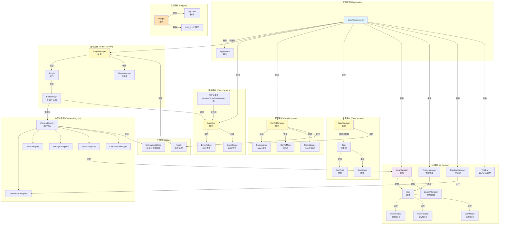

# DearTs Framework 核心组件详解

## 核心模块关系图



## 1. 应用程序 (Application)

### Application 基类

核心应用程序基类，管理完整的应用生命周期。

**核心功能：**
- SDL3 初始化和清理
- 主循环管理
- 事件处理
- 帧率控制
- 生命周期回调

**生命周期：**

```cpp
enum class ApplicationState {
    UNINITIALIZED,  // 未初始化
    INITIALIZING,   // 初始化中
    RUNNING,        // 运行中
    PAUSED,         // 已暂停
    STOPPING,       // 停止中
    STOPPED         // 已停止
};
```

**关键方法：**

```cpp
class Application {
public:
    // 生命周期控制
    virtual bool initialize(const ApplicationConfig& config);
    virtual int run();
    virtual void shutdown();
    void request_exit(int exit_code = 0);

protected:
    // 回调函数（子类重写）
    virtual bool on_init();           // 初始化回调
    virtual void on_update(double delta_time);  // 每帧更新
    virtual void on_render();          // 渲染回调
    virtual void on_event(const SDL_Event& event);  // 事件处理
    virtual void on_shutdown();        // 关闭回调
    virtual void on_pause();           // 暂停回调
    virtual void on_resume();          // 恢复回调
};
```

**使用示例：**

```cpp
class MyApp : public DearTs::Core::App::Application {
protected:
    bool on_init() override {
        LOG_INFO("Application initializing");
        // 初始化系统
        return true;
    }

    void on_render() override {
        ImGui::Begin("Hello");
        ImGui::Text("Hello DearTs!");
        ImGui::End();
    }
};

int main() {
    MyApp app;
    ApplicationConfig config{
        .name = "My App",
        .window_width = 1280,
        .window_height = 720
    };
    app.initialize(config);
    return app.run();
}
```

## 2. 事件系统 (Event System)

### EventBus

类型安全的事件总线，支持发布-订阅模式。

**核心特性：**
- 编译时类型安全（使用模板和 type_index）
- RAII 自动取消订阅（EventToken）
- 同步和异步事件发布
- 线程安全（recursive_mutex）

**关键类：**

```cpp
class EventBus {
public:
    // 订阅事件
    template<typename T>
    [[nodiscard]] EventToken subscribe(std::function<void(const T&)> callback);

    // 取消订阅
    template<typename T>
    void unsubscribe(const EventToken& token);

    // 同步发布
    template<typename T>
    void publish(const T& event);

    // 异步发布
    template<typename T>
    void publish_async(const T& event);

    // 处理异步事件队列
    void process_async_events();
};

// RAII 守卫
template<typename T>
class EventGuard {
    // 析构时自动取消订阅
};
```

**使用示例：**

```cpp
// 定义事件
struct DataModifiedEvent {
    size_t offset;
    size_t size;
};

// 订阅事件（RAII 自动取消）
EventBus::Token token = EventBus::instance().subscribe<DataModifiedEvent>(
    [](const DataModifiedEvent& e) {
        LOG_INFO("Data modified: {} bytes at offset {}", e.size, e.offset);
    }
);
// token 析构时自动取消订阅

// 或使用 EventGuard
EventGuard<DataModifiedEvent> guard([](const DataModifiedEvent& e) {
    // 处理事件
});

// 发布事件
EventBus::instance().publish(DataModifiedEvent{ .offset = 0, .size = 1024 });

// 异步发布
EventBus::instance().publish_async(DataModifiedEvent{ .offset = 0, .size = 1024 });
```

**预定义事件：**

```cpp
// 应用程序生命周期事件
class EventApplicationInitialized;
class EventApplicationShutdown;

// 窗口事件
class EventWindowClose;
class EventWindowResize;

// 帧事件
class EventFrameBegin;
class EventFrameEnd;

// 键盘事件
class EventKeyPressed;

// 请求事件
class EventRequestExit;
```

## 3. 插件系统 (Plugin System)

### IPlugin 接口

所有插件必须继承的基类。

**插件信息：**

```cpp
struct PluginInfo {
    std::string name;           // 插件名称
    std::string author;         // 插件作者
    std::string description;    // 插件描述
    std::string version;        // 插件版本
    std::string api_version;    // 需要 API 版本

    bool is_api_compatible(const std::string& current_api_version) const;
};
```

**插件接口：**

```cpp
class IPlugin {
public:
    virtual ~IPlugin() = default;

    // 获取插件信息（必须实现）
    [[nodiscard]] virtual PluginInfo get_info() const = 0;

    // 生命周期回调（可选重写）
    virtual Result<void, std::string> on_load();
    virtual void on_unload();
    virtual void on_enable();
    virtual void on_disable();
};
```

### PluginManager

管理所有插件的生命周期。

**插件状态：**

```cpp
enum class PluginState {
    Unloaded,   // 未加载
    Loaded,     // 已加载
    Enabled,    // 已启用
    Disabled,   // 已禁用
    Error       // 错误状态
};
```

**PluginManager API：**

```cpp
class PluginManager {
public:
    // 加载插件
    Result<void, std::string> load_from_file(const std::filesystem::path& path);
    Result<void, std::string> add_builtin(std::unique_ptr<IPlugin> plugin);
    Result<size_t, std::string> load_from_directory(const std::filesystem::path& directory);

    // 控制插件
    bool unload(const std::string& name);
    Result<void, std::string> enable(const std::string& name);
    Result<void, std::string> disable(const std::string& name);
    Result<void, std::string> reload(const std::string& name);

    // 查询插件
    [[nodiscard]] IPlugin* get_plugin(const std::string& name);
    [[nodiscard]] std::vector<PluginInfo> get_all_plugins_info() const;
    [[nodiscard]] Result<PluginState, std::string> get_plugin_state(const std::string& name) const;
};
```

**使用示例：**

```cpp
class MyPlugin : public IPlugin {
public:
    PluginInfo get_info() const override {
        return PluginInfo{
            .name = "MyPlugin",
            .author = "Your Name",
            .description = "My awesome plugin",
            .version = "1.0.0",
            .api_version = "1.0.0"
        };
    }

    Result<void, std::string> on_load() override {
        // 注册视图
        ContentRegistry::Views::add<MyView>();

        // 注册命令
        ContentRegistry::Commands::add("myplugin.action", "My Action", []() {
            LOG_INFO("Action executed");
        });

        return Result::ok();
    }

    void on_unload() override {
        // 清理资源（RAII 会自动处理大部分）
    }
};

// 注册内置插件
PluginManager::instance().add_builtin(std::make_unique<MyPlugin>());

// 或从文件加载
PluginManager::instance().load_from_file("plugins/myplugin.dll");
```

## 4. 内容注册表 (Content Registry)

参考 ImHex 设计的集中式扩展点管理系统。

### Commands 命令注册

用于注册可通过命令面板执行的命令。

```cpp
struct CommandItem {
    UnlocalizedString name;        // 命令名称
    std::string description;       // 命令描述
    std::string shortcut;          // 快捷键
    Callback callback;             // 命令回调
    EnabledCallback enabled_callback;  // 启用条件回调
};

// 使用
ContentRegistry::Commands::add("myplugin.action", "My Action", []() {
    // 执行命令
})
.shortcut("Ctrl+Shift+M")
.enabled_callback([]() { return true; });
```

### Views 视图注册

注册 ImGui 视图窗口。

```cpp
// 定义视图
class MyView : public ViewWindow {
public:
    MyView() : ViewWindow("myplugin.my_view") {}

    void draw_content() override {
        ImGui::Text("Hello from MyView!");
    }
};

// 注册
ContentRegistry::Views::add<MyView>();

// 获取视图
View* view = ContentRegistry::Views::get_by_name("myplugin.my_view");
```

### Tools 工具注册

注册工具窗口。

```cpp
ContentRegistry::Tools::add("My Tool", []() {
    ImGui::Text("Tool content");
});
```

### Settings 设置注册

注册设置项。

```cpp
ContentRegistry::Settings::add(
    "myplugin.setting_name",
    "Setting Display Name",
    default_value
);
```

## 5. UI 系统 (UI System)

### View 基类

所有 ImGui 视图的基类。

**视图类型：**

```cpp
// 普通停靠窗口
class ViewWindow : public View;

// 浮动窗口（不可停靠）
class ViewFloating : public View;

// 模态窗口（置顶，阻塞其他窗口）
class ViewModal : public View;
```

**View 接口：**

```cpp
class View {
public:
    // 必须实现
    virtual void draw(ImGuiWindowFlags extra_flags) = 0;
    virtual void draw_content() = 0;

    // 可选重写
    virtual bool should_draw() const;
    virtual bool should_process() const;
    virtual ImVec2 get_min_size() const;
    virtual ImVec2 get_max_size() const;
    virtual ImGuiWindowFlags get_window_flags() const;
    virtual void on_open();
    virtual void on_close();
};
```

**使用示例：**

```cpp
class MyView : public ViewWindow {
public:
    MyView() : ViewWindow("myplugin.my_view", ICON_SMILE) {}

    void draw_content() override {
        if (ImGui::Button("Click me")) {
            LOG_INFO("Button clicked");
        }
    }
};

// 注册
ContentRegistry::Views::add<MyView>();
```

### ViewManager

管理所有视图的生命周期和停靠布局。

```cpp
class ViewManager {
public:
    // 添加视图
    void addView(std::unique_ptr<View> view);

    // 查询视图
    [[nodiscard]] View* getViewByName(const std::string& name) const;
    [[nodiscard]] View* getFocusedView() const;

    // 渲染
    void renderAllViews();
    void createMainDockSpace(const ImVec2& viewport_size);

    // 布局控制
    void setLayoutLocked(bool locked);
    [[nodiscard]] bool isLayoutLocked() const;
};
```

### ThemeManager

管理 ImGui 主题。

```cpp
class ThemeManager {
public:
    // 设置主题
    void setTheme(Theme theme);

    // 切换主题
    void toggleTheme();
};
```

### ShortcutManager

管理全局快捷键。

```cpp
class ShortcutManager {
public:
    // 注册快捷键
    void addShortcut(const std::string& shortcut, Callback callback);

    // 处理快捷键
    bool handle_shortcuts(const SDL_Event& event);
};
```

## 6. 配置系统 (Config System)

### ConfigManager

类型安全的分层配置管理器。

**配置值类型：**

```cpp
using ConfigValue = std::variant<bool, int, double, std::string>;
```

**ConfigManager API：**

```cpp
class ConfigManager {
public:
    // 设置值
    template<typename T>
    Result<void, std::string> set(const std::string& key, T value);

    // 获取值
    template<typename T>
    [[nodiscard]] Result<T, std::string> get(const std::string& key) const;

    template<typename T>
    [[nodiscard]] T get_or(const std::string& key, T default_value) const;

    // 持久化
    Result<void, std::string> load_from_file(const std::filesystem::path& path);
    Result<void, std::string> save_to_file(const std::filesystem::path& path);

    // 元数据
    void register_meta(const std::string& key, ConfigMeta meta);

    // 变更回调
    void add_change_callback(std::function<void(const std::string&, const ConfigValue&, const ConfigValue&)> callback);
};
```

### ConfigScope

RAII 配置作用域，自动添加前缀。

```cpp
class ConfigScope {
public:
    explicit ConfigScope(const std::string& prefix);

    template<typename T>
    Result<void, std::string> set(const std::string& key, T value);

    template<typename T>
    [[nodiscard]] T get_or(const std::string& key, T default_value) const;
};

// 使用
{
    ConfigScope cfg("myplugin");
    cfg.set("enabled", true);  // 存储为 "myplugin.enabled"
    bool enabled = cfg.get_or<bool>("enabled", true);
}
```

**使用示例：**

```cpp
// 设置配置
ConfigManager::instance().set("app.window.width", 1280);
ConfigManager::instance().set("app.window.height", 720);

// 获取配置
int width = ConfigManager::instance().get_or<int>("app.window.width", 1280);

// 使用 ConfigScope
ConfigScope cfg("app.window");
cfg.set("width", 1280);
cfg.set("height", 720);

// 注册元数据
ConfigManager::instance().register_meta("app.window.width", {
    .description = "Window width",
    .default_value = 1280,
    .is_required = false,
    .validate_callback = [](const ConfigValue& v) {
        if (std::holds_alternative<int>(v)) {
            int w = std::get<int>(v);
            if (w < 640) return Result<void, std::string>::err("Too small");
        }
        return Result::ok();
    }
});

// 加载/保存
ConfigManager::instance().load_from_file("config.json");
ConfigManager::instance().save_to_file("config.json");
```

## 7. 任务系统 (Task System)

### TaskManager

异步任务管理器。

**任务类型：**

```cpp
enum class TaskType {
    Normal,     // 普通任务
    Background, // 后台任务（不影响UI）
    Blocking,   // 阻塞任务（等待完成）
    Critical    // 关键任务（高优先级）
};
```

**任务状态：**

```cpp
enum class TaskStatus {
    Pending,    // 等待执行
    Running,    // 正在执行
    Completed,  // 已完成
    Cancelled,  // 已取消
    Failed      // 失败
};
```

**TaskManager API：**

```cpp
class TaskManager {
public:
    // 创建任务
    std::shared_ptr<Task> create(const std::string& name, Task::TaskFunc func, TaskType type);

    // 创建并启动
    std::shared_ptr<Task> launch(const std::string& name, Task::TaskFunc func, TaskType type);

    // 控制任务
    void start(std::shared_ptr<Task> task);
    void cancel(std::shared_ptr<Task> task);

    // 查询
    [[nodiscard]] std::vector<std::shared_ptr<Task>> getRunningTasks() const;
    [[nodiscard]] size_t getRunningTaskCount() const;

    // 批量操作
    void waitForAll();
    void cancelAll();
    void update();  // 清理已完成任务
};
```

**Task API：**

```cpp
class Task {
public:
    // 进度
    [[nodiscard]] float getProgress() const;
    [[nodiscard]] float getProgressPercent() const;
    void setProgress(float progress);
    void addProgress(float delta);

    // 状态
    [[nodiscard]] TaskStatus getStatus() const;
    [[nodiscard]] bool isFinished() const;
    [[nodiscard]] bool isRunning() const;

    // 取消
    void cancel();
    [[nodiscard]] bool shouldCancel() const;

    // 回调
    void onCompleted(std::function<void()> callback);
};
```

**使用示例：**

```cpp
// 启动任务
auto task = TaskManager::instance().launch(
    "Loading File",
    [](const std::atomic<bool>& should_cancel) {
        for (int i = 0; i < 100 && !should_cancel; i++) {
            // 处理数据
            task->setProgress(i);
        }
        return Result::ok();
    },
    TaskType::Normal
);

// 检查完成
if (task->isFinished()) {
    LOG_INFO("Task completed");
}

// 取消任务
task->cancel();
```

## 8. 日志系统 (Logging)

### Logger

线程安全的异步日志系统。

**日志级别：**

```cpp
enum class LogLevel : int {
    TRACE = 0,    // 详细跟踪信息
    DEBUG = 1,    // 调试信息
    INFO = 2,     // 一般信息
    WARN = 3,     // 警告信息
    ERROR = 4,    // 错误信息
    FATAL = 5     // 致命错误信息
};
```

**Logger API：**

```cpp
class Logger {
public:
    // 配置
    void set_level(LogLevel level);
    void enable_file_output(const std::string& filename, bool enable = true);
    void set_buffer_size(size_t size);

    // 日志记录
    void trace(const std::string& msg);
    void debug(const std::string& msg);
    void info(const std::string& msg);
    void warn(const std::string& msg);
    void error(const std::string& msg);
    void fatal(const std::string& msg);
};
```

**日志宏：**

```cpp
// 格式化日志（推荐）
LOG_TRACE("File: {}, Line: {}", file, line);
LOG_DEBUG("Value: {}", value);
LOG_INFO("Application started");
LOG_WARN("Deprecated feature used");
LOG_ERROR("Failed to load: {}", error);
LOG_FATAL("Critical error: {}", error);

// 简单字符串日志
LOG_INFO_STR("Simple message");
```

**使用示例：**

```cpp
// 获取 Logger 实例
auto& logger = Logger::get_instance();

// 配置
logger.set_level(LogLevel::DEBUG);
logger.enable_file_output("logs/app.log", true);

// 记录日志
LOG_INFO("Application starting...");
LOG_ERROR("Failed to open file: {}", filename);

// 在代码中使用
void process_file(const std::string& path) {
    LOG_DEBUG("Processing file: {}", path);

    if (!file_exists(path)) {
        LOG_ERROR("File not found: {}", path);
        return;
    }

    LOG_INFO("File processed successfully");
}
```

## 9. 错误处理 (Result<T, E>)

### Result 类型

类型安全的错误处理，替代异常。

```cpp
template<typename T, typename E>
class Result {
public:
    // 构造
    static Result ok(T value);
    static Result err(E error);

    // 查询
    [[nodiscard]] bool isOk() const;
    [[nodiscard]] bool isErr() const;

    // 获取值
    [[nodiscard]] const T& unwrap() const;
    [[nodiscard]] const T& unwrap_or(const T& default_value) const;
    [[nodiscard]] const E& error() const;
};
```

**使用示例：**

```cpp
// 返回 Result
Result<Data, std::string> load_data(const std::string& path) {
    if (!file_exists(path)) {
        return Result::err("File not found");
    }
    Data data = parse_file(path);
    return Result::ok(data);
}

// 使用 Result
auto result = load_data("data.json");
if (result.isOk()) {
    const Data& data = result.unwrap();
    // 使用数据
} else {
    LOG_ERROR("Failed to load: {}", result.error());
}

// 或使用 unwrap_or
const Data& data = load_data("data.json").unwrap_or(default_data);
```

## 最佳实践

### ✅ DO

1. **使用 Result<T, E> 处理错误**，而非异常
2. **使用 RAII 管理资源**（EventToken, ConfigScope, 智能指针）
3. **通过 Content Registry 注册扩展**，而非直接修改核心
4. **使用 EventBus 解耦模块**
5. **配置使用 ConfigScope 添加前缀**
6. **日志记录重要操作**

### ❌ DON'T

1. **不要使用异常做控制流**
2. **不要忘记 API 版本匹配**
3. **不要使用全局状态**
4. **不要手动管理资源**（让 RAII 处理）
5. **不要在回调中访问可能死锁的资源**
6. **不要在插件加载时执行耗时操作**

## 下一步

- [学习事件系统详解](./03-事件系统.md)
- [了解 UI 系统详解](./04-UI系统.md)
- [开始插件开发](./05-插件开发指南.md)
