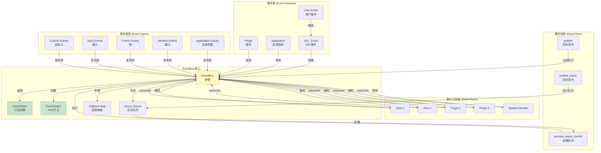
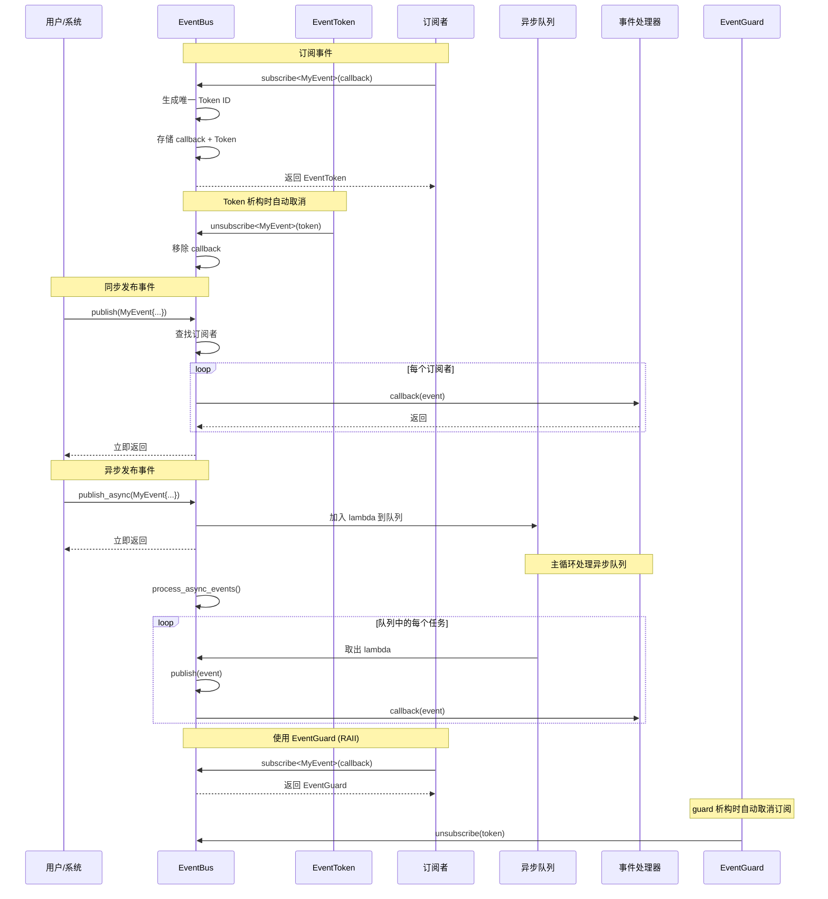

# DearTs Framework 事件系统详解

## 事件系统架构图



## 事件系统流程图



## 概述

DearTs Framework 的事件系统是一个**类型安全**、**线程安全**的发布-订阅模式实现，支持：

- ✅ **编译时类型安全** - 使用模板和 type_index
- ✅ **RAII 自动管理** - EventToken 和 EventGuard 自动取消订阅
- ✅ **同步/异步发布** - 支持立即执行和队列延迟执行
- ✅ **异常安全** - 回调中的异常不会中断其他订阅者
- ✅ **线程安全** - 使用 recursive_mutex 保护

## 核心组件

### 1. EventBus

事件总线的核心实现。

**类定义：**

```cpp
class EventBus {
public:
    // 单例
    static EventBus& instance();

    // 订阅事件
    template<typename T>
    [[nodiscard]] EventToken subscribe(std::function<void(const T&)> callback);

    // 取消订阅
    template<typename T>
    void unsubscribe(const EventToken& token);

    // 同步发布
    template<typename T>
    void publish(const T& event);

    // 异步发布
    template<typename T>
    void publish_async(const T& event);

    // 处理异步队列
    void process_async_events();

    // 清空所有订阅
    void clear();

private:
    std::recursive_mutex m_mutex;
    EventToken::ID m_next_token_id = 1;
    std::unordered_map<std::type_index, std::vector<CallbackWrapper>> m_callbacks;
    std::mutex m_async_mutex;
    std::vector<std::function<void()>> m_async_queue;
};
```

### 2. EventToken

订阅令牌，用于管理订阅生命周期。

**类定义：**

```cpp
class EventToken {
public:
    using ID = uint64_t;

    EventToken();
    explicit EventToken(ID id);

    [[nodiscard]] bool is_valid() const;
    [[nodiscard]] ID get_id() const;
    void invalidate();
};
```

**特性：**
- ✅ 支持拷贝（复制 Token，多个引用同一订阅）
- ✅ 支持移动（转移所有权）
- ✅ 可失效（invalidate 后无法再使用）

### 3. EventGuard

RAII 守卫，自动管理订阅生命周期。

**类定义：**

```cpp
template<typename T>
class EventGuard {
public:
    using CallbackType = std::function<void(const T&)>;

    explicit EventGuard(CallbackType callback);
    ~EventGuard();  // 自动取消订阅

    // 删除拷贝
    EventGuard(const EventGuard&) = delete;
    EventGuard& operator=(const EventGuard&) = delete;

    // 支持移动
    EventGuard(EventGuard&& other) noexcept;
    EventGuard& operator=(EventGuard&& other) noexcept;
};
```

**特性：**
- ✅ 构造时自动订阅
- ✅ 析构时自动取消订阅
- ✅ 不可拷贝，只能移动
- ✅ 异常安全

## 预定义事件

### 应用程序生命周期事件

```cpp
// 应用初始化完成
class EventApplicationInitialized : public Event {
public:
    [[nodiscard]] std::string get_name() const override;
    [[nodiscard]] size_t get_type_id() const override;
};

// 应用即将关闭
class EventApplicationShutdown : public Event {
public:
    explicit EventApplicationShutdown(int exit_code);
    [[nodiscard]] int get_exit_code() const;
};
```

### 窗口事件

```cpp
// 窗口关闭请求
class EventWindowClose : public Event {
public:
    [[nodiscard]] std::string get_name() const override;
};

// 窗口大小改变
class EventWindowResize : public Event {
public:
    explicit EventWindowResize(int width, int height);
    [[nodiscard]] int get_width() const;
    [[nodiscard]] int get_height() const;
};
```

### 帧事件

```cpp
// 帧开始
class EventFrameBegin : public Event {
public:
    explicit EventFrameBegin(double delta_time);
    [[nodiscard]] double get_delta_time() const;
};

// 帧结束
class EventFrameEnd : public Event {
public:
    [[nodiscard]] std::string get_name() const override;
};
```

### 键盘事件

```cpp
// 键盘按下
class EventKeyPressed : public Event {
public:
    explicit EventKeyPressed(int key_code, bool repeat);
    [[nodiscard]] int get_key_code() const;
    [[nodiscard]] bool is_repeat() const;
};
```

### 请求事件

```cpp
// 请求退出应用
class EventRequestExit : public Event {
public:
    explicit EventRequestExit(int exit_code = 0);
    [[nodiscard]] int get_exit_code() const;
};
```

## 使用指南

### 1. 定义自定义事件

```cpp
// 定义简单事件
struct MyEvent {
    std::string message;
    int value;
};

// 定义继承 Event 的事件（支持更多功能）
class DataModifiedEvent : public Event {
public:
    explicit DataModifiedEvent(size_t offset, size_t size)
        : m_offset(offset), m_size(size) {}

    [[nodiscard]] std::string get_name() const override {
        return "DataModifiedEvent";
    }

    [[nodiscard]] size_t get_type_id() const override {
        return static_cast<size_t>(EventType::DataModified);
    }

    [[nodiscard]] size_t get_offset() const { return m_offset; }
    [[nodiscard]] size_t get_size() const { return m_size; }

private:
    size_t m_offset;
    size_t m_size;
};
```

### 2. 订阅事件

**方法 1: 使用 EventToken（手动管理）**

```cpp
class MyPlugin : public IPlugin {
private:
    EventBus::Token m_eventToken;

public:
    Result<void, std::string> on_load() override {
        // 订阅事件
        m_eventToken = EventBus::instance().subscribe<DataModifiedEvent>(
            [](const DataModifiedEvent& e) {
                LOG_INFO("Data modified: {} bytes at offset {}",
                         e.get_size(), e.get_offset());
            }
        );
        return Result::ok();
    }

    void on_unload() override {
        // 手动取消订阅（或依赖 Token 析构自动取消）
        EventBus::instance().unsubscribe<DataModifiedEvent>(m_eventToken);
    }
};
```

**方法 2: 使用 EventGuard（RAII 自动管理）**

```cpp
class MyPlugin : public IPlugin {
private:
    EventGuard<DataModifiedEvent> m_eventGuard;

public:
    Result<void, std::string> on_load() override {
        // EventGuard 自动管理生命周期
        m_eventGuard = EventGuard<DataModifiedEvent>(
            [](const DataModifiedEvent& e) {
                LOG_INFO("Data modified: {} bytes at offset {}",
                         e.get_size(), e.get_offset());
            }
        );
        return Result::ok();
    }

    // 析构时自动取消订阅，无需 on_unload()
};
```

**方法 3: 临时订阅（函数作用域）**

```cpp
void my_function() {
    // 在函数作用域内订阅
    auto token = EventBus::instance().subscribe<MyEvent>(
        [](const MyEvent& e) {
            LOG_INFO("Received: {}", e.message);
        }
    );

    // ... 执行操作 ...

    // 函数结束时 token 析构，自动取消订阅
}
```

### 3. 发布事件

**同步发布**

```cpp
// 立即执行所有订阅者的回调
EventBus::instance().publish(DataModifiedEvent{0, 1024});

// 所有订阅者立即收到通知并执行
```

**异步发布**

```cpp
// 加入队列，稍后处理
EventBus::instance().publish_async(DataModifiedEvent{0, 1024});

// 在主循环中处理异步事件
void main_loop() {
    while (running) {
        // 处理事件、更新、渲染
        handle_events();
        update();
        render();

        // 处理异步事件队列
        EventBus::instance().process_async_events();
    }
}
```

### 4. 处理事件中的异常

```cpp
EventBus::instance().subscribe<MyEvent>(
    [](const MyEvent& e) {
        try {
            // 可能抛出异常的操作
            risky_operation();
        } catch (const std::exception& ex) {
            LOG_ERROR("Error in event handler: {}", ex.what());
            // 异常不会中断其他订阅者
        }
    }
);
```

### 5. 取消订阅

```cpp
// 保存 Token
EventBus::Token token = EventBus::instance().subscribe<MyEvent>(callback);

// ... 稍后取消订阅
EventBus::instance().unsubscribe<MyEvent>(token);

// 或使用 invalidate()
token.invalidate();
```

## 最佳实践

### ✅ DO

1. **使用 EventGuard 管理订阅生命周期**
   ```cpp
   class MyPlugin {
   private:
       EventGuard<MyEvent> m_guard;  // RAII 自动管理
   };
   ```

2. **在事件回调中使用 try-catch**
   ```cpp
   EventBus::instance().subscribe<MyEvent>(
       [](const MyEvent& e) {
           try {
               // 处理事件
           } catch (const std::exception& ex) {
               LOG_ERROR("Event handler error: {}", ex.what());
           }
       }
   );
   ```

3. **异步事件用于解耦耗时操作**
   ```cpp
   EventBus::instance().publish_async(HeavyEvent{...});
   // 在主循环中：EventBus::instance().process_async_events();
   ```

4. **使用自定义事件结构传递数据**
   ```cpp
   struct FileLoadedEvent {
       std::string path;
       std::vector<char> data;
   };
   ```

5. **在主循环中处理异步队列**
   ```cpp
   while (app.is_running()) {
       app.handle_events();
       app.update();
       app.render();

       // 处理异步事件
       EventBus::instance().process_async_events();
   }
   ```

### ❌ DON'T

1. **不要在事件回调中访问 EventBus**
   ```cpp
   // ❌ 死锁风险
   EventBus::instance().subscribe<EventA>(
       [](const EventA& e) {
           // ❌ 不要在回调中发布/订阅其他事件
           EventBus::instance().publish<EventB>(...);
       }
   );

   // ✅ 使用异步发布避免死锁
   EventBus::instance().subscribe<EventA>(
       [](const EventA& e) {
           // ✅ 异步发布，避免死锁
           EventBus::instance().publish_async<EventB>(...);
       }
   );
   ```

2. **不要忘记处理异步事件队列**
   ```cpp
   // ❌ 忘记调用 process_async_events()
   while (running) {
       handle_events();
       update();
       render();
       // 异步事件永远不会被处理！
   }

   // ✅ 在主循环中调用
   while (running) {
       handle_events();
       update();
       render();
       EventBus::instance().process_async_events();  // ✅
   }
   ```

3. **不要在事件回调中执行耗时操作**
   ```cpp
   // ❌ 阻塞主线程
   EventBus::instance().subscribe<EventA>(
       [](const EventA& e) {
           // ❌ 耗时操作阻塞主线程
           heavy_computation();
       }
   );

   // ✅ 使用异步任务
   EventBus::instance().subscribe<EventA>(
       [](const EventA& e) {
           // ✅ 启动后台任务
           TaskManager::instance().launch("Heavy Task",
               [](const auto& cancel) {
                   heavy_computation();
               }
           );
       }
   );
   ```

4. **不要让订阅者生命周期超过事件源**
   ```cpp
   // ❌ 危险：Token 持有到插件卸载后
   class MyPlugin {
   private:
       EventBus::Token m_token;  // 插件卸载后可能无效
   };

   // ✅ 使用 EventGuard 或在 on_unload() 中取消订阅
   class MyPlugin {
   private:
       EventGuard<MyEvent> m_guard;  // RAII 自动管理
   };
   ```

## 高级用法

### 1. 事件链

```cpp
// 事件 A 触发事件 B
EventBus::instance().subscribe<EventA>(
    [](const EventA& e) {
        // 处理 A 后发布 B
        EventBus::instance().publish_async<EventB>(...);
    }
);
```

### 2. 条件订阅

```cpp
// 只在满足条件时订阅
if (some_condition) {
    auto token = EventBus::instance().subscribe<Event>(callback);
    // ...
}
```

### 3. 事件过滤器

```cpp
// 使用 lambda 过滤事件
EventBus::instance().subscribe<DataModifiedEvent>(
    [](const DataModifiedEvent& e) {
        // 只处理特定偏移的事件
        if (e.get_offset() < 0x1000) {
            LOG_INFO("Processing: {}", e.get_offset());
        }
    }
);
```

### 4. 事件聚合

```cpp
// 聚合多个事件
struct AggregatedEvent {
    std::vector<DataModifiedEvent> events;
};

EventBus::instance().subscribe<DataModifiedEvent>(
    [](const DataModifiedEvent& e) {
        // 收集事件并聚合
        // 稍后发布 AggregatedEvent
    }
);
```

## 调试技巧

### 1. 记录事件发布

```cpp
EventBus::instance().subscribe<MyEvent>(
    [](const MyEvent& e) {
        LOG_DEBUG("Event received: {}", e.message);
    }
);
```

### 2. 跟踪订阅数量

```cpp
size_t count = EventBus::instance().get_subscriber_count<MyEvent>();
LOG_INFO("MyEvent subscribers: {}", count);
```

### 3. 验证 Token 有效性

```cpp
if (token.is_valid()) {
    LOG_INFO("Token is valid");
}
```

## 下一步

- [阅读核心组件详解](./02-核心组件.md)
- [了解 UI 系统](./04-UI系统.md)
- [开始插件开发](./05-插件开发指南.md)
