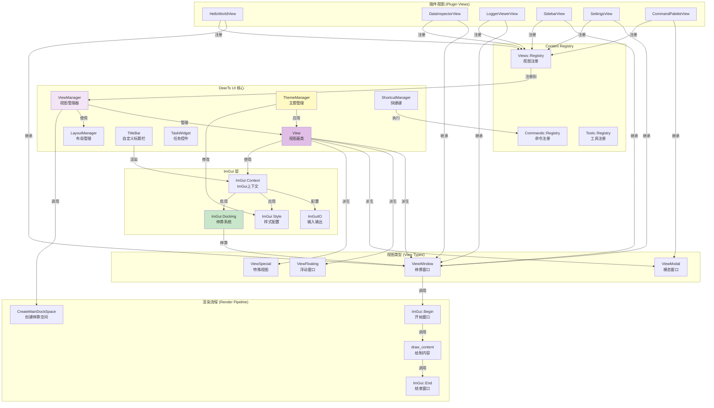
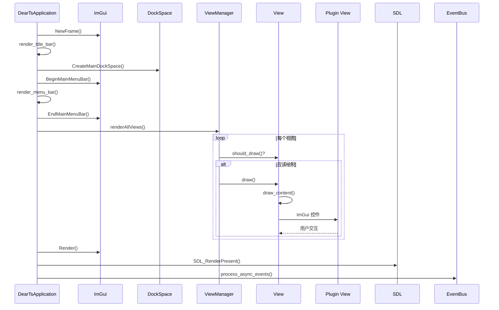

# DearTs Framework UI 系统详解

## UI 系统架构图



## 渲染流程图



## 概述

DearTs Framework 的 UI 系统基于 ImGui 构建，提供：

- ✅ **多视图停靠系统** - 灵活的窗口布局
- ✅ **自定义标题栏** - 现代化外观
- ✅ **主题管理** - 支持亮色/暗色主题切换
- ✅ **快捷键系统** - 全局快捷键支持
- ✅ **任务进度控件** - 异步任务可视化
- ✅ **多种视图类型** - 停靠窗口、浮动窗口、模态窗口

## 核心组件

### 1. View 基类

所有 ImGui 视图的基类。

**类定义：**

```cpp
class View {
public:
    explicit View(UnlocalizedString unlocalized_name, const char* icon = nullptr);
    virtual ~View() = default;

    // 必须实现
    virtual void draw(ImGuiWindowFlags extra_flags) = 0;
    virtual void draw_content() = 0;

    // 可选重写
    virtual bool should_draw() const;
    virtual bool should_process() const;
    virtual bool has_view_menu_entry() const;
    virtual ImVec2 get_min_size() const;
    virtual ImVec2 get_max_size() const;
    virtual ImGuiWindowFlags get_window_flags() const;
    virtual bool should_store_window_state() const;
    virtual void draw_help_text();
    virtual void on_open();
    virtual void on_close();

    // 状态查询
    [[nodiscard]] const char* get_icon() const;
    [[nodiscard]] std::string get_name() const;
    [[nodiscard]] bool& get_window_open_state();
    [[nodiscard]] bool is_focused() const;
    [[nodiscard]] bool did_window_just_open();
    [[nodiscard]] bool did_window_just_close();
    void bring_to_front();
    void track_window_state();

protected:
    UnlocalizedString m_unlocalized_name;
    bool m_window_open = false;
    const char* m_icon = nullptr;
    bool m_focused = false;
    bool m_window_just_opened = false;
    bool m_window_just_closed = false;
};
```

### 2. 视图类型

#### ViewWindow - 停靠窗口

标准的可停靠窗口视图。

```cpp
class ViewWindow : public View {
public:
    explicit ViewWindow(UnlocalizedString unlocalized_name, const char* icon = nullptr);

    void draw(ImGuiWindowFlags extra_flags) override;
};
```

**使用示例：**

```cpp
class MyView : public ViewWindow {
public:
    MyView() : ViewWindow("myplugin.my_view", ICON_SMILE) {}

    void draw_content() override {
        ImGui::Text("Hello from MyView!");

        if (ImGui::Button("Click me")) {
            LOG_INFO("Button clicked");
        }

        ImGui::InputText("Input", m_buffer, sizeof(m_buffer));
    }

private:
    char m_buffer[256] = "";
};

// 注册
ContentRegistry::Views::add<MyView>();
```

#### ViewFloating - 浮动窗口

不可停靠的浮动窗口。

```cpp
class ViewFloating : public ViewWindow {
public:
    explicit ViewFloating(UnlocalizedString unlocalized_name, const char* icon = nullptr);

    void draw(ImGuiWindowFlags extra_flags) override;
    [[nodiscard]] bool should_store_window_state() const override;
};
```

**使用示例：**

```cpp
class PopupView : public ViewFloating {
public:
    PopupView() : ViewFloating("myplugin.popup") {}

    void draw_content() override {
        ImGui::Text("This is a floating window");
    }
};
```

#### ViewModal - 模态窗口

始终置顶且阻止其他窗口输入。

```cpp
class ViewModal : public View {
public:
    explicit ViewModal(UnlocalizedString unlocalized_name, const char* icon = nullptr);

    void draw(ImGuiWindowFlags extra_flags) override;
    [[nodiscard]] virtual bool has_close_button() const;
    [[nodiscard]] bool should_store_window_state() const override;
};
```

**使用示例：**

```cpp
class AboutDialog : public ViewModal {
public:
    AboutDialog() : ViewModal("app.about") {}

    void draw_content() override {
        ImGui::Text("DearTs Framework v1.0.0");
        ImGui::Separator();
        ImGui::Text("A modern C++20 application framework");

        if (ImGui::Button("Close")) {
            get_window_open_state() = false;
        }
    }
};
```

#### ViewSpecial - 特殊视图

不处理窗口创建，只绘制内容。

```cpp
class ViewSpecial : public View {
public:
    explicit ViewSpecial(UnlocalizedString unlocalized_name);

    void draw(ImGuiWindowFlags extra_flags) override;
};
```

### 3. ViewManager

管理所有视图的生命周期和停靠布局。

**类定义：**

```cpp
class ViewManager {
public:
    static ViewManager& instance();

    // 添加视图
    void addView(std::unique_ptr<View> view);

    // 移除视图
    void removeView(const std::string& name);

    // 查询
    [[nodiscard]] View* getViewByName(const std::string& name) const;
    [[nodiscard]] View* getFocusedView() const;
    [[nodiscard]] const std::map<std::string, std::unique_ptr<View>>& getAllViews() const;

    // 渲染
    void renderAllViews();
    void createMainDockSpace(const ImVec2& viewport_size);

    // 布局控制
    void setLayoutLocked(bool locked);
    [[nodiscard]] bool isLayoutLocked() const;
    void closeAllViews();
};
```

**使用示例：**

```cpp
// 注册视图
ViewManager::instance().addView(std::make_unique<MyView>());

// 获取视图
View* view = ViewManager::instance().getViewByName("myplugin.my_view");
if (view) {
    view->get_window_open_state() = true;  // 打开视图
}

// 获取聚焦的视图
View* focused = ViewManager::instance().getFocusedView();
if (focused) {
    LOG_INFO("Focused view: {}", focused->get_name());
}
```

### 4. ThemeManager

管理 ImGui 主题。

**类定义：**

```cpp
class ThemeManager {
public:
    static ThemeManager& instance();

    void setTheme(Theme theme);
    void toggleTheme();
    [[nodiscard]] Theme getCurrentTheme() const;
};

enum class Theme {
    Light,
    Dark
};
```

**使用示例：**

```cpp
// 设置主题
ThemeManager::instance().setTheme(Theme::Dark);

// 切换主题
ThemeManager::instance().toggleTheme();

// 获取当前主题
Theme current = ThemeManager::instance().getCurrentTheme();
```

### 5. ShortcutManager

管理全局快捷键。

**类定义：**

```cpp
class ShortcutManager {
public:
    static ShortcutManager& instance();

    void addShortcut(const std::string& shortcut, Callback callback);
    bool handle_shortcuts(const SDL_Event& event);
    void remove_shortcut(const std::string& shortcut);
};
```

**使用示例：**

```cpp
// 注册快捷键
ShortcutManager::instance().addShortcut("Ctrl+Shift+P", []() {
    // 打开命令面板
    ContentRegistry::Views::get_by_name("cmd.palette")->get_window_open_state() = true;
});

// 在事件处理中
void on_event(const SDL_Event& event) override {
    ShortcutManager::instance().handle_shortcuts(event);
}
```

### 6. TitleBar

自定义标题栏。

**类定义：**

```cpp
class TitleBar {
public:
    void render(float& title_bar_height);
    void handle_input(const SDL_Event& event);

private:
    void draw_title_buttons();
    void handle_dragging();
};
```

### 7. LayoutManager

管理窗口布局。

**类定义：**

```cpp
class LayoutManager {
public:
    static LayoutManager& instance();

    void save_layout(const std::string& name);
    void load_layout(const std::string& name);
    void reset_layout();

    [[nodiscard]] std::vector<std::string> get_saved_layouts() const;
};
```

## 创建自定义视图

### 1. 基础视图

```cpp
class MyView : public ViewWindow {
public:
    MyView() : ViewWindow("myplugin.my_view", ICON_DESCRIPTION) {}

    void draw_content() override {
        // 绘制 ImGui 内容
        ImGui::Text("Hello, World!");

        if (ImGui::Button("Click Me")) {
            LOG_INFO("Button clicked");
        }
    }
};

// 注册
ContentRegistry::Views::add<MyView>();
```

### 2. 带状态的视图

```cpp
class DataView : public ViewWindow {
public:
    DataView() : ViewWindow("myplugin.data_view") {
        // 初始化状态
        m_data = load_data();
    }

    void draw_content() override {
        // 显示数据
        ImGui::Text("Data size: {}", m_data.size());

        // 列表
        if (ImGui::BeginListBox("Items")) {
            for (const auto& item : m_data) {
                ImGui::Selectable(item.c_str());
            }
            ImGui::EndListBox();
        }
    }

private:
    std::vector<std::string> m_data;
};
```

### 3. 响应窗口事件的视图

```cpp
class InteractiveView : public ViewWindow {
public:
    InteractiveView() : ViewWindow("myplugin.interactive") {}

    void on_open() override {
        LOG_INFO("View opened");
        // 初始化资源
    }

    void on_close() override {
        LOG_INFO("View closed");
        // 清理资源
    }

    void draw_content() override {
        if (did_window_just_open()) {
            LOG_INFO("Window just opened");
        }

        if (is_focused()) {
            ImGui::Text("This view is focused");
        }
    }
};
```

### 4. 带工具栏的视图

```cpp
class ToolbarView : public ViewWindow {
public:
    ToolbarView() : ViewWindow("myplugin.toolbar") {}

    void draw_content() override {
        // 工具栏
        if (ImGui::Button("Open")) {
            on_open_clicked();
        }
        ImGui::SameLine();
        if (ImGui::Button("Save")) {
            on_save_clicked();
        }
        ImGui::Separator();

        // 内容区域
        draw_content_area();
    }

private:
    void on_open_clicked() { /* ... */ }
    void on_save_clicked() { /* ... */ }
    void draw_content_area() { /* ... */ }
};
```

### 5. 表格视图

```cpp
class TableView : public ViewWindow {
public:
    TableView() : ViewWindow("myplugin.table") {}

    void draw_content() override {
        // 表格
        if (ImGui::BeginTable("MyTable", 3,
                              ImGuiTableFlags_Resizable |
                              ImGuiTableFlags_Reorderable |
                              ImGuiTableFlags_Hideable)) {
            ImGui::TableSetupColumn("ID");
            ImGui::TableSetupColumn("Name");
            ImGui::TableSetupColumn("Value");
            ImGui::TableHeadersRow();

            for (const auto& row : m_data) {
                ImGui::TableNextRow();
                ImGui::TableSetColumnIndex(0);
                ImGui::Text("%d", row.id);
                ImGui::TableSetColumnIndex(1);
                ImGui::Text("%s", row.name.c_str());
                ImGui::TableSetColumnIndex(2);
                ImGui::Text("%f", row.value);
            }

            ImGui::EndTable();
        }
    }

private:
    struct Row {
        int id;
        std::string name;
        float value;
    };
    std::vector<Row> m_data;
};
```

### 6. 树形视图

```cpp
class TreeView : public ViewWindow {
public:
    TreeView() : ViewWindow("myplugin.tree") {}

    void draw_content() override {
        // 树形结构
        draw_node("Root", 0);
    }

private:
    void draw_node(const std::string& label, int depth) {
        ImGuiTreeNodeFlags flags = ImGuiTreeNodeFlags_OpenOnArrow |
                                  ImGuiTreeNodeFlags_OpenOnDoubleClick;

        if (depth == 0) {
            flags |= ImGuiTreeNodeFlags_DefaultOpen;
        }

        if (ImGui::TreeNodeEx(label.c_str(), flags)) {
            // 子节点
            for (const auto& child : m_children[label]) {
                draw_node(child, depth + 1);
            }
            ImGui::TreePop();
        }
    }

    std::map<std::string, std::vector<std::string>> m_children;
};
```

## 最佳实践

### ✅ DO

1. **使用 ViewWindow 作为默认视图类型**
2. **为视图提供图标**
   ```cpp
   MyView() : ViewWindow("myplugin.my_view", ICON_SMILE) {}
   ```

3. **使用 UnlocalizedString 作为视图名称**
   ```cpp
   ViewWindow(UnlocalizedString("myplugin.my_view"))
   ```

4. **重写 on_open/on_open 处理生命周期**
5. **使用 ImGui ID 避免冲突**
   ```cpp
   ImGui::PushID(this);  // 使用视图指针作为 ID
   // ... ImGui 控件 ...
   ImGui::PopID();
   ```

6. **检查 should_draw() 和 should_process()**
7. **使用 ImGui::SameLine() 水平布局**
8. **使用 ImGui::Separator() 分隔内容**

### ❌ DON'T

1. **不要在 draw_content() 中执行耗时操作**
2. **不要忘记调用父类方法（如果有）**
3. **不要使用硬编码的窗口大小**
4. **不要在视图中直接访问其他视图**
5. **不要在析构函数中访问 ImGui**
6. **不要在 draw_content() 外调用 ImGui 函数**

## 主题定制

### 自定义颜色

```cpp
ImGuiStyle& style = ImGui::GetStyle();

// 修改颜色
style.Colors[ImGuiCol_WindowBg] = ImVec4(0.1f, 0.1f, 0.1f, 1.0f);
style.Colors[ImGuiCol_TitleBg] = ImVec4(0.2f, 0.2f, 0.2f, 1.0f);
```

### 自定义样式

```cpp
// 圆角
style.WindowRounding = 5.0f;
style.FrameRounding = 3.0f;

// 间距
style.WindowPadding = ImVec2(8, 8);
style.ItemSpacing = ImVec2(4, 4);

// 字体
ImFontConfig config;
config.SizePixels = 16.0f;
ImGui::GetIO().Fonts->AddFontDefault(&config);
```

## 下一步

- [阅读核心组件详解](./02-核心组件.md)
- [学习事件系统](./03-事件系统.md)
- [开始插件开发](./05-插件开发指南.md)
