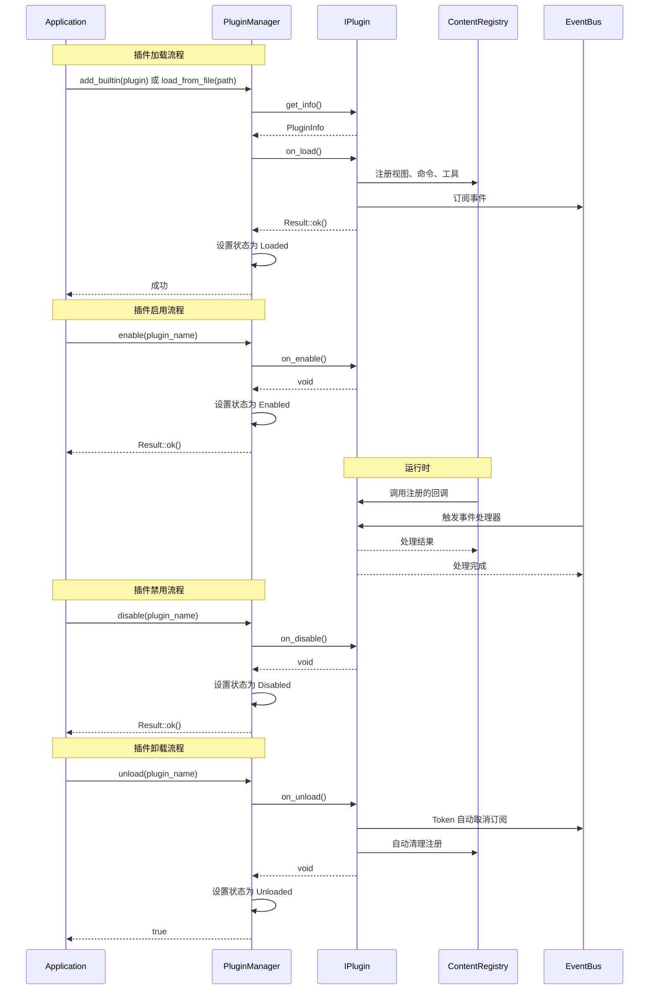

# DearTs Framework 插件开发指南

## 插件系统架构图

```mermaid
graph TB
    subgraph "插件生命周期 (Plugin Lifecycle)"
        UNLOADED[Unloaded<br/>未加载]
        LOADED[Loaded<br/>已加载]
        ENABLED[Enabled<br/>已启用]
        DISABLED[Disabled<br/>已禁用]
        ERROR[Error<br/>错误]
    end

    subgraph "IPlugin 接口"
        GET_INFO[get_info<br/>获取插件信息]
        ON_LOAD[on_load<br/>加载回调]
        ON_UNLOAD[on_unload<br/>卸载回调]
        ON_ENABLE[on_enable<br/>启用回调]
        ON_DISABLE[on_disable<br/>禁用回调]
    end

    subgraph "PluginManager"
        ADD_BUILTIN[add_builtin<br/>添加内置插件]
        LOAD_FILE[load_from_file<br/>从文件加载]
        LOAD_DIR[load_from_directory<br/>从目录加载]
        ENABLE[enable<br/>启用插件]
        DISABLE[disable<br/>禁用插件]
        RELOAD[reload<br/>重载插件]
        UNLOAD[unload<br/>卸载插件]
    end

    subgraph "插件扩展点 (Extension Points)"
        VIEWS[Views::Registry<br/>视图注册]
        COMMANDS[Commands::Registry<br/>命令注册]
        TOOLS[Tools::Registry<br/>工具注册]
        SETTINGS[Settings::Registry<br/>设置注册]
        EVENTS[EventBus<br/>事件订阅]
        CONFIG[ConfigManager<br/>配置管理]
        TASKS[TaskManager<br/>任务管理]
    end

    subgraph "内置插件 (Built-in Plugins)"
        BUILTIN[BuiltinPlugin<br/>内置插件]
        CMD_PALETTE[CommandPalettePlugin<br/>命令面板]
        SETTINGS[SettingsPlugin<br/>设置插件]
        NAVIGATION[NavigationPlugin<br/>导航插件]
        LOGGER[LoggerViewerPlugin<br/>日志查看器]
        TOAST[ToastNotificationPlugin<br/>Toast通知]
    end

    subgraph "插件实现 (Plugin Implementation)"
        MY_PLUGIN[MyPlugin<br/>自定义插件]
        MY_VIEW[MyView<br/>自定义视图]
        MY_CMD[MyCommand<br/>自定义命令]
    end

    %% 生命周期转换
    UNLOADED -->|add_builtin/load_from_file| LOADED
    LOADED -->|enable| ENABLED
    ENABLED -->|disable| DISABLED
    DISABLED -->|enable| ENABLED
    LOADED -->|unload| UNLOADED
    LOADED -->|error| ERROR

    %% IPlugin 接口
    GET_INFO -.->|必须实现| MY_PLUGIN
    ON_LOAD -.->|可选| MY_PLUGIN
    ON_UNLOAD -.->|可选| MY_PLUGIN
    ON_ENABLE -.->|可选| MY_PLUGIN
    ON_DISABLE -.->|可选| MY_PLUGIN

    %% PluginManager 操作
    ADD_BUILTIN -->|加载| MY_PLUGIN
    LOAD_FILE -->|加载| MY_PLUGIN
    LOAD_DIR -->|批量加载| MY_PLUGIN
    ENABLE -->|启用| MY_PLUGIN
    DISABLE -->|禁用| MY_PLUGIN
    RELOAD -->|重载| MY_PLUGIN
    UNLOAD -->|卸载| MY_PLUGIN

    %% 插件使用扩展点
    MY_PLUGIN -->|注册| VIEWS
    MY_PLUGIN -->|注册| COMMANDS
    MY_PLUGIN -->|注册| TOOLS
    MY_PLUGIN -->|注册| SETTINGS
    MY_PLUGIN -->|订阅| EVENTS
    MY_PLUGIN -->|使用| CONFIG
    MY_PLUGIN -->|启动| TASKS

    %% 自定义内容
    MY_VIEW -.->|继承View| MY_PLUGIN
    MY_CMD -.->|命令| MY_PLUGIN

    %% 内置插件
    BUILTIN -->|注册| VIEWS
    CMD_PALETTE -->|注册| VIEWS
    SETTINGS -->|注册| VIEWS
    NAVIGATION -->|注册| VIEWS
    LOGGER -->|注册| VIEWS
    TOAST -->|注册| VIEWS

    BUILTIN -->|注册| COMMANDS
    CMD_PALETTE -->|注册| COMMANDS
    SETTINGS -->|注册| SETTINGS

    style MY_PLUGIN fill:#c8e6c9
    style VIEWS fill:#e1f5fe
    style COMMANDS fill:#e1f5fe
    style TOOLS fill:#e1f5fe
    style SETTINGS fill:#e1f5fe
```



## 插件生命周期流程图



## 概述

DearTs Framework 采用**插件优先架构**，所有功能通过插件实现。核心框架只提供基础设施：

- ✅ **类型安全的事件系统**
- ✅ **Content Registry 扩展机制**
- ✅ **动态插件加载**
- ✅ **API 版本检查**
- ✅ **完整的生命周期管理**

## 创建你的第一个插件

### 1. 基础插件结构

```cpp
// my_plugin.hpp
#pragma once

#include "core/plugin/plugin.h"

namespace MyPlugin {

class MyPlugin : public DearTs::Core::Plugin::IPlugin {
public:
    // 必须实现：返回插件信息
    DearTs::Core::Plugin::PluginInfo get_info() const override {
        return DearTs::Core::Plugin::PluginInfo{
            .name = "MyPlugin",
            .author = "Your Name",
            .description = "My awesome plugin",
            .version = "1.0.0",
            .api_version = "1.0.0"  // 必须匹配框架版本
        };
    }

    // 可选：插件加载时调用
    DearTs::Result<void, std::string> on_load() override {
        LOG_INFO("MyPlugin loading...");

        // 注册视图、命令、工具等
        ContentRegistry::Views::add<MyView>();

        return DearTs::Result<void, std::string>::ok();
    }

    // 可选：插件卸载时调用
    void on_unload() override {
        LOG_INFO("MyPlugin unloading...");
        // RAII 会自动清理大部分资源
    }

    // 可选：插件启用时调用
    void on_enable() override {
        LOG_INFO("MyPlugin enabled");
    }

    // 可选：插件禁用时调用
    void on_disable() override {
        LOG_INFO("MyPlugin disabled");
    }
};

} // namespace MyPlugin
```

### 2. 注册插件

**方法 1: 内置插件（编译时链接）**

```cpp
// 在应用程序初始化中
void DearTsApplication::setup_plugins() {
    // 添加内置插件
    PluginManager::instance().add_builtin(
        std::make_unique<MyPlugin::MyPlugin>()
    );
}
```

**方法 2: 动态加载插件（运行时加载）**

```cpp
// 从文件加载插件
auto result = PluginManager::instance().load_from_file("plugins/myplugin.dll");
if (result.isErr()) {
    LOG_ERROR("Failed to load plugin: {}", result.error());
}

// 或从目录加载所有插件
auto count = PluginManager::instance().load_from_directory("plugins/");
if (count.isErr()) {
    LOG_ERROR("Failed to load plugins: {}", count.error());
} else {
    LOG_INFO("Loaded {} plugins", count.unwrap());
}
```

### 3. 动态库插件

如果创建动态库插件，需要导出插件创建函数：

```cpp
// my_plugin.cpp
#include "my_plugin.hpp"

extern "C" {
    // 导出创建函数
    __declspec(dllexport) DearTs::Core::Plugin::IPlugin* dearts_create_plugin() {
        return new MyPlugin::MyPlugin();
    }

    // 导出销毁函数
    __declspec(dllexport) void dearts_destroy_plugin(DearTs::Core::Plugin::IPlugin* plugin) {
        delete plugin;
    }
}
```

## 插件功能

### 1. 注册视图

```cpp
class MyPlugin : public IPlugin {
private:
    // 定义视图
    class MyView : public ViewWindow {
    public:
        MyView() : ViewWindow("myplugin.my_view", ICON_SMILE) {}

        void draw_content() override {
            ImGui::Text("Hello from MyPlugin!");
            ImGui::Separator();

            if (ImGui::Button("Click Me")) {
                LOG_INFO("Button clicked");
            }
        }
    };

public:
    Result<void, std::string> on_load() override {
        // 注册视图
        ContentRegistry::Views::add<MyView>();

        return Result::ok();
    }
};
```

### 2. 注册命令

```cpp
Result<void, std::string> on_load() override {
    // 注册命令
    ContentRegistry::Commands::add(
        "myplugin.hello",
        "Say Hello",
        []() {
            LOG_INFO("Hello from command!");
        }
    ).shortcut("Ctrl+Shift+H")
     .enabled_callback([]() { return true; });

    return Result::ok();
}
```

### 3. 注册工具

```cpp
Result<void, std::string> on_load() override {
    // 注册工具窗口
    ContentRegistry::Tools::add("My Tool", []() {
        ImGui::Text("Tool content");
        if (ImGui::Button("Action")) {
            LOG_INFO("Tool action");
        }
    });

    return Result::ok();
}
```

### 4. 注册设置

```cpp
Result<void, std::string> on_load() override {
    // 注册设置项
    ContentRegistry::Settings::add(
        "myplugin.enabled",
        "Enable MyPlugin",
        true
    );

    ContentRegistry::Settings::add(
        "myplugin.interval",
        "Update Interval",
        60
    );

    return Result::ok();
}
```

### 5. 订阅事件

```cpp
class MyPlugin : public IPlugin {
private:
    EventGuard<DataModifiedEvent> m_eventGuard;

public:
    Result<void, std::string> on_load() override {
        // 订阅事件（RAII 自动管理）
        m_eventGuard = EventGuard<DataModifiedEvent>(
            [](const DataModifiedEvent& e) {
                LOG_INFO("Data modified: {} bytes at offset {}",
                         e.get_size(), e.get_offset());
            }
        );

        return Result::ok();
    }
};
```

### 6. 使用配置

```cpp
class MyPlugin : public IPlugin {
private:
    ConfigScope m_config{"myplugin"};

public:
    Result<void, std::string> on_load() override {
        // 读取配置
        bool enabled = m_config.get_or<bool>("enabled", true);
        int interval = m_config.get_or<int>("interval", 60);

        LOG_INFO("Plugin enabled: {}, interval: {}", enabled, interval);

        // 保存配置
        m_config.set("last_run", std::time(nullptr));

        return Result::ok();
    }
};
```

### 7. 启动后台任务

```cpp
class MyPlugin : public IPlugin {
private:
    std::shared_ptr<Task> m_task;

public:
    Result<void, std::string> on_load() override {
        // 启动后台任务
        m_task = TaskManager::instance().launch(
            "MyPlugin Background Task",
            [this](const std::atomic<bool>& should_cancel) {
                for (int i = 0; i < 100 && !should_cancel; i++) {
                    // 处理数据
                    std::this_thread::sleep_for(std::chrono::milliseconds(100));
                }
            },
            TaskType::Background
        );

        return Result::ok();
    }
};
```

## 完整示例

### 示例 1: Hello World 插件

```cpp
// hello_world_plugin.hpp
#pragma once

#include "core/plugin/plugin.h"
#include "core/ui/view.h"
#include "liblogger/logger.h"

namespace HelloWorldPlugin {

class HelloView : public ViewWindow {
public:
    HelloView() : ViewWindow("helloworld.hello_view", ICON_Smile) {}

    void draw_content() override {
        ImGui::Text("Hello, World!");
        ImGui::Separator();

        ImGui::Text("This is a simple plugin example.");

        if (ImGui::Button("Greet")) {
            LOG_INFO("Hello from HelloView!");
        }
    }
};

class HelloWorldPlugin : public IPlugin {
public:
    PluginInfo get_info() const override {
        return PluginInfo{
            .name = "HelloWorld",
            .author = "Your Name",
            .description = "A simple Hello World plugin",
            .version = "1.0.0",
            .api_version = "1.0.0"
        };
    }

    Result<void, std::string> on_load() override {
        LOG_INFO("HelloWorld plugin loading");

        // 注册视图
        ContentRegistry::Views::add<HelloView>();

        // 注册命令
        ContentRegistry::Commands::add(
            "helloworld.greet",
            "Greet",
            []() {
                LOG_INFO("Hello from command!");
            }
        );

        return Result::ok();
    }

    void on_unload() override {
        LOG_INFO("HelloWorld plugin unloading");
    }
};

} // namespace HelloWorldPlugin
```

### 示例 2: 数据处理器插件

```cpp
// data_processor_plugin.hpp
#pragma once

#include "core/plugin/plugin.h"
#include "core/ui/view.h"
#include "core/tasks/task_manager.h"
#include "core/config/config_manager.h"
#include <vector>

namespace DataProcessorPlugin {

class DataProcessorView : public ViewWindow {
public:
    DataProcessorView() : ViewWindow("dataprocessor.view", ICON_Analytics) {}

    void draw_content() override {
        ImGui::Text("Data Processor");

        // 输入文本
        char input[256] = "";
        ImGui::InputText("Input", input, sizeof(input));

        // 处理按钮
        if (ImGui::Button("Process")) {
            process_data(std::string(input));
        }

        ImGui::Separator();

        // 显示结果
        ImGui::Text("Results:");
        for (const auto& result : m_results) {
            ImGui::BulletText("%s", result.c_str());
        }
    }

private:
    void process_data(const std::string& data) {
        // 启动后台任务处理数据
        TaskManager::instance().launch(
            "Processing Data",
            [this, data](const std::atomic<bool>& should_cancel) {
                std::string result = "Processed: " + data;

                // 在主线程更新 UI
                // 注意：这里需要使用线程安全的方式更新
                m_results.push_back(result);
            }
        );
    }

    std::vector<std::string> m_results;
};

class DataProcessorPlugin : public IPlugin {
private:
    ConfigScope m_config{"dataprocessor"};

public:
    PluginInfo get_info() const override {
        return PluginInfo{
            .name = "DataProcessor",
            .author = "Your Name",
            .description = "Process and analyze data",
            .version = "1.0.0",
            .api_version = "1.0.0"
        };
    }

    Result<void, std::string> on_load() override {
        LOG_INFO("DataProcessor plugin loading");

        // 读取配置
        int max_items = m_config.get_or<int>("max_items", 100);

        // 注册视图
        ContentRegistry::Views::add<DataProcessorView>();

        // 注册命令
        ContentRegistry::Commands::add(
            "dataprocessor.clear",
            "Clear Results",
            []() {
                LOG_INFO("Clearing results");
            }
        ).shortcut("Ctrl+Shift+D");

        return Result::ok();
    }

    void on_unload() override {
        // 保存配置
        m_config.set("last_used", std::time(nullptr));
        LOG_INFO("DataProcessor plugin unloading");
    }
};

} // namespace DataProcessorPlugin
```

### 示例 3: 文件监视插件

```cpp
// file_watcher_plugin.hpp
#pragma once

#include "core/plugin/plugin.h"
#include "core/ui/view.h"
#include "core/event/event_bus.h"
#include <filesystem>
#include <unordered_set>

namespace FileWatcherPlugin {

// 文件修改事件
struct FileModifiedEvent {
    std::string path;
    std::time_t timestamp;
};

class FileWatcherView : public ViewWindow {
public:
    FileWatcherView() : ViewWindow("filewatcher.view", ICON_Folder) {}

    void on_open() override {
        // 订阅文件修改事件
        m_eventGuard = EventGuard<FileModifiedEvent>(
            [this](const FileModifiedEvent& e) {
                m_modified_files.push_back(e.path);
            }
        );
    }

    void draw_content() override {
        ImGui::Text("File Watcher");

        // 添加监视路径
        char path[256] = "";
        ImGui::InputText("Path", path, sizeof(path));
        ImGui::SameLine();
        if (ImGui::Button("Watch")) {
            watch_path(std::string(path));
        }

        ImGui::Separator();

        // 显示修改的文件
        ImGui::Text("Modified Files:");
        if (ImGui::BeginListBox("##files")) {
            for (const auto& file : m_modified_files) {
                ImGui::Selectable(file.c_str());
            }
            ImGui::EndListBox();
        }
    }

private:
    void watch_path(const std::string& path) {
        // 启动后台任务监视文件
        TaskManager::instance().launch(
            "Watching: " + path,
            [this, path](const std::atomic<bool>& should_cancel) {
                while (!should_cancel) {
                    // 检查文件修改
                    if (file_modified(path)) {
                        EventBus::instance().publish(FileModifiedEvent{
                            .path = path,
                            .timestamp = std::time(nullptr)
                        });
                    }
                    std::this_thread::sleep_for(std::chrono::seconds(1));
                }
            },
            TaskType::Background
        );
    }

    bool file_modified(const std::string& path) {
        // 检查文件是否被修改
        return std::filesystem::exists(path);
    }

    EventGuard<FileModifiedEvent> m_eventGuard;
    std::vector<std::string> m_modified_files;
};

class FileWatcherPlugin : public IPlugin {
public:
    PluginInfo get_info() const override {
        return PluginInfo{
            .name = "FileWatcher",
            .author = "Your Name",
            .description = "Watch files for changes",
            .version = "1.0.0",
            .api_version = "1.0.0"
        };
    }

    Result<void, std::string> on_load() override {
        LOG_INFO("FileWatcher plugin loading");

        // 注册视图
        ContentRegistry::Views::add<FileWatcherView>();

        return Result::ok();
    }
};

} // namespace FileWatcherPlugin
```

## 插件最佳实践

### ✅ DO

1. **使用 RAII 管理资源**
   ```cpp
   class MyPlugin : public IPlugin {
   private:
       EventGuard<MyEvent> m_eventGuard;  // 自动取消订阅
       ConfigScope m_config{"myplugin"};  // 自动前缀
   };
   ```

2. **使用 Result<T, E> 处理错误**
   ```cpp
   Result<void, std::string> on_load() override {
       if (!init()) {
           return Result::err("Initialization failed");
       }
       return Result::ok();
   }
   ```

3. **使用前缀避免命名冲突**
   ```cpp
   // 视图名称
   "myplugin.my_view"

   // 命令名称
   "myplugin.action"

   // 设置键名
   "myplugin.setting_name"
   ```

4. **在后台任务中执行耗时操作**
   ```cpp
   TaskManager::instance().launch("Heavy Task",
       [](const auto& cancel) {
           heavy_computation();
       }
   );
   ```

5. **记录重要操作**
   ```cpp
   LOG_INFO("Plugin loading");
   LOG_ERROR("Failed to load: {}", error);
   ```

6. **使用 ConfigScope 管理配置**
   ```cpp
   ConfigScope cfg("myplugin");
   cfg.set("key", value);
   ```

### ❌ DON'T

1. **不要忘记 API 版本**
   ```cpp
   // ❌ 错误
   .api_version = "0.9.0"  // 不匹配框架版本

   // ✅ 正确
   .api_version = "1.0.0"  // 必须匹配
   ```

2. **不要在 on_load() 中执行耗时操作**
   ```cpp
   // ❌ 错误：阻塞插件加载
   Result<void, std::string> on_load() override {
       heavy_computation();  // 阻塞！
       return Result::ok();
   }

   // ✅ 正确：使用后台任务
   Result<void, std::string> on_load() override {
       TaskManager::instance().launch("Init",
           [](const auto& cancel) {
               heavy_computation();
           }
       );
       return Result::ok();
   }
   ```

3. **不要使用全局状态**
   ```cpp
   // ❌ 错误
   static std::vector<int> g_data;

   // ✅ 正确：使用成员变量
   class MyPlugin : public IPlugin {
   private:
       std::vector<int> m_data;
   };
   ```

4. **不要在插件卸载后访问资源**
   ```cpp
   // ❌ 危险：插件卸载后 Token 可能无效
   class MyPlugin {
   private:
       EventBus::Token m_token;  // 可能导致悬空引用
   };

   // ✅ 使用 EventGuard
   class MyPlugin {
   private:
       EventGuard<MyEvent> m_guard;  // RAII 自动管理
   };
   ```

5. **不要在事件回调中发布同步事件**
   ```cpp
   // ❌ 死锁风险
   EventBus::instance().subscribe<EventA>(
       [](const EventA& e) {
           EventBus::instance().publish<EventB>(...);  // 死锁！
       }
   );

   // ✅ 使用异步发布
   EventBus::instance().subscribe<EventA>(
       [](const EventA& e) {
           EventBus::instance().publish_async<EventB>(...);  // 安全
       }
   );
   ```

## 调试插件

### 1. 检查插件状态

```cpp
// 获取插件状态
auto state = PluginManager::instance().get_plugin_state("MyPlugin");
if (state.isOk()) {
    LOG_INFO("Plugin state: {}", static_cast<int>(state.unwrap()));
}

// 获取所有插件信息
auto plugins = PluginManager::instance().get_all_plugins_info();
for (const auto& info : plugins) {
    LOG_INFO("Plugin: {} v{} by {}", info.name, info.version, info.author);
}
```

### 2. 日志记录

```cpp
// 在插件生命周期中添加日志
Result<void, std::string> on_load() override {
    LOG_INFO("MyPlugin loading...");
    // ...
    LOG_INFO("MyPlugin loaded successfully");
    return Result::ok();
}

void on_unload() override {
    LOG_INFO("MyPlugin unloading...");
}
```

### 3. 错误处理

```cpp
Result<void, std::string> on_load() override {
    // 尝试初始化
    if (!init_resource()) {
        return Result::err("Failed to initialize resource");
    }

    // 尝试加载配置
    auto config = load_config();
    if (config.isErr()) {
        return Result::err("Config error: " + config.error());
    }

    return Result::ok();
}
```

## 插件发布

### 1. 目录结构

```
my_plugin/
├── include/
│   └── my_plugin.hpp
├── source/
│   └── my_plugin.cpp
├── CMakeLists.txt
└── README.md
```

### 2. CMakeLists.txt

```cmake
cmake_minimum_required(VERSION 3.20)
project(MyPlugin VERSION 1.0.0)

# 设置 C++20
set(CMAKE_CXX_STANDARD 20)
set(CMAKE_CXX_STANDARD_REQUIRED ON)

# 查找 DearTs
find_package(DearTs REQUIRED)

# 创建插件库
add_library(my_plugin SHARED
    source/my_plugin.cpp
)

target_include_directories(my_plugin PUBLIC
    ${DearTs_INCLUDE_DIRS}
    include
)

target_link_libraries(my_plugin
    DearTs::Core
)

# 安装
install(TARGETS my_plugin
    LIBRARY DESTINATION plugins
    RUNTIME DESTINATION plugins
)
```

### 3. README.md

```markdown
# MyPlugin

DearTs Framework 插件示例。

## 功能

- 功能 1
- 功能 2

## 安装

1. 编译插件
2. 将编译后的库文件复制到 `plugins/` 目录
3. 重启应用

## 使用

- 打开视图：View → My Plugin
- 快捷键：Ctrl+Shift+M

## 配置

在设置中可以配置：
- `myplugin.enabled` - 启用/禁用插件
- `myplugin.interval` - 更新间隔

## 作者

Your Name

## 许可证

MIT
```

## 下一步

- [阅读架构总览](./01-架构总览.md)
- [学习核心组件](./02-核心组件.md)
- [了解事件系统](./03-事件系统.md)
- [查看 UI 系统](./04-UI系统.md)
