# DearTs Framework 架构文档

> DearTs Framework 完整架构说明

## 目录结构图

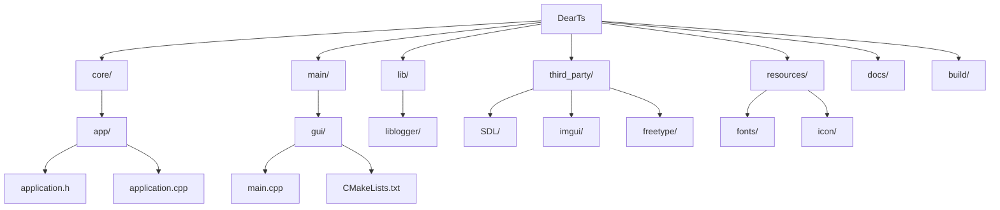

## 应用程序生命周期

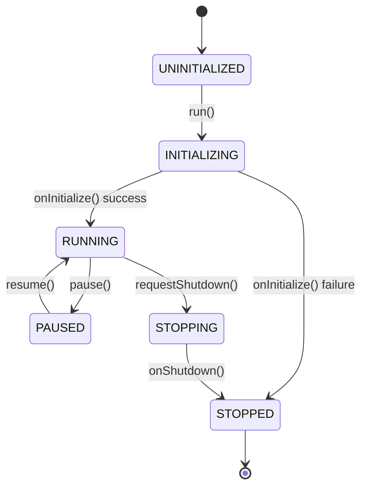

## 核心类关系图

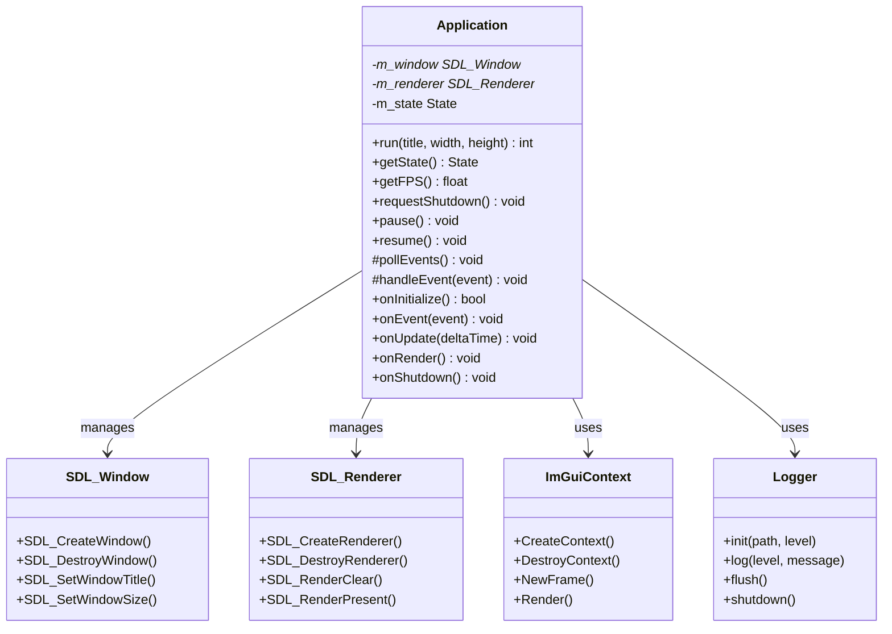

## 主循环流程

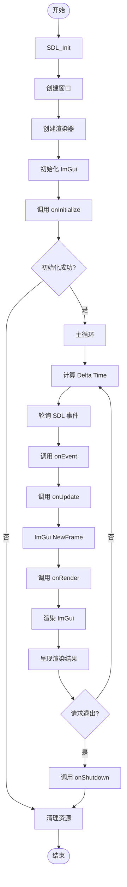

## 模块依赖关系

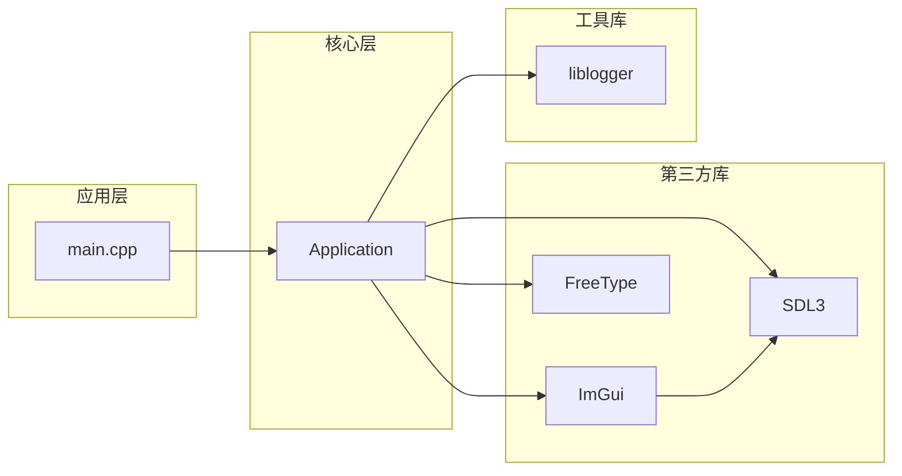

## 事件处理流程

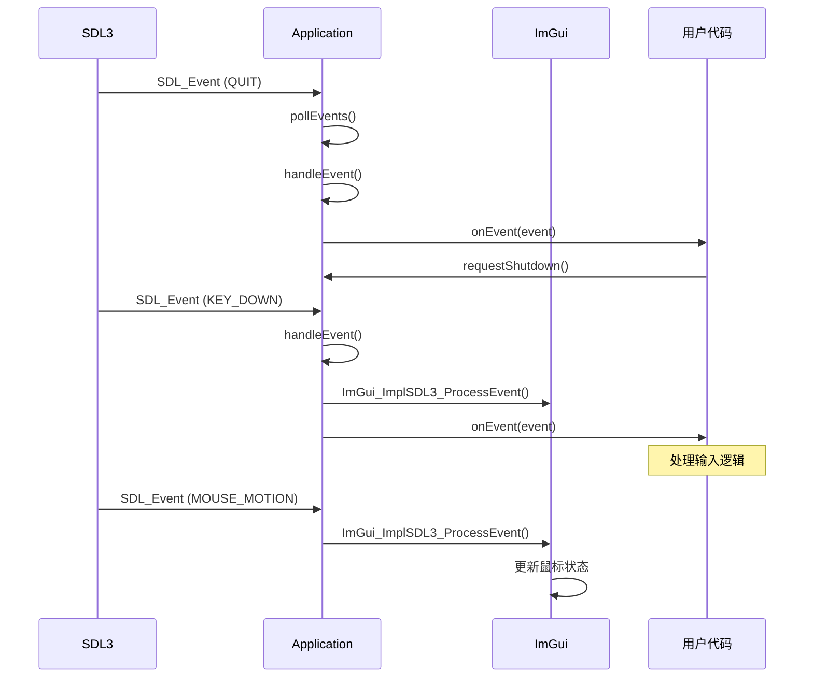

## 渲染管线

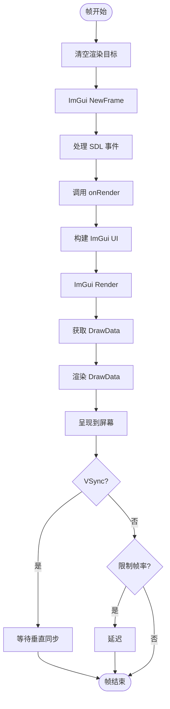

## 数据流向

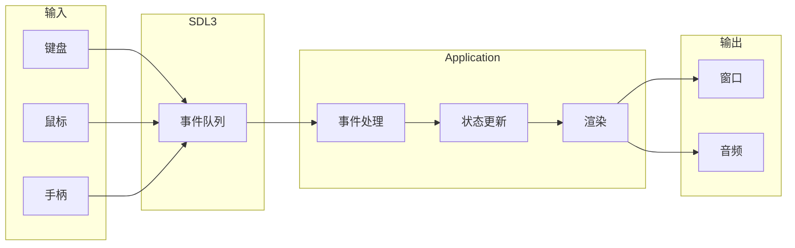

## 构建系统

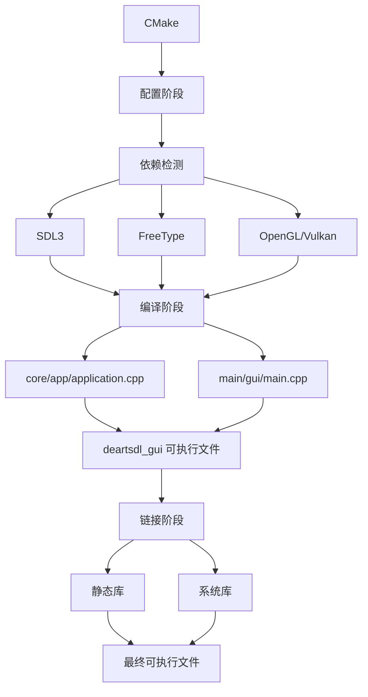

## 内存管理架构

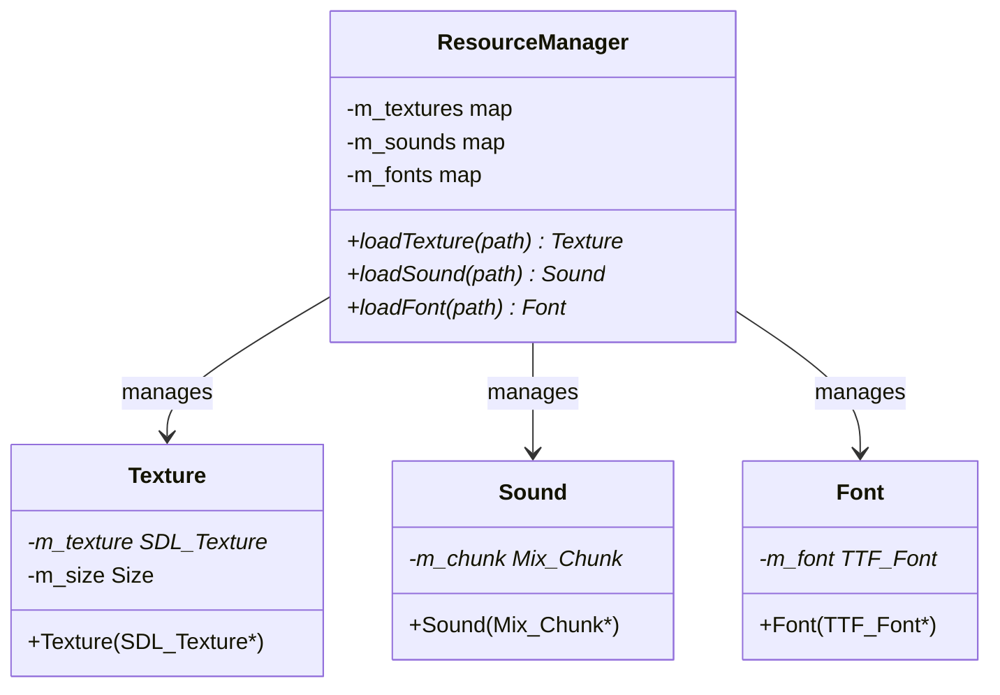

## 性能监控系统

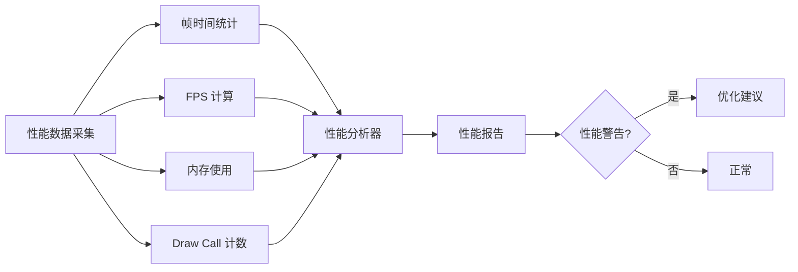

## 错误处理流程

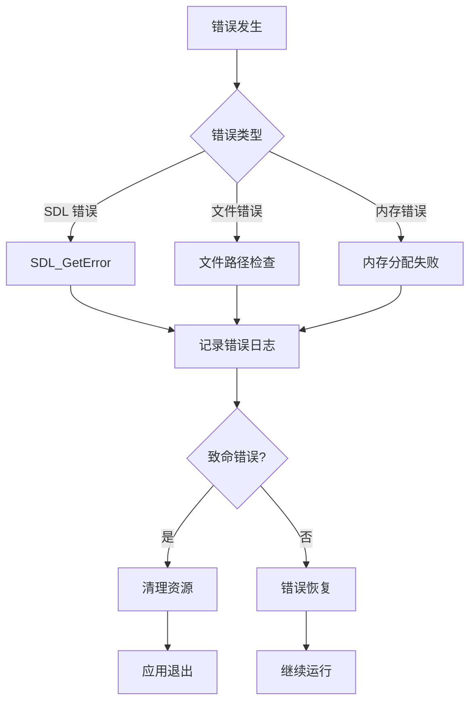

## 扩展模块规划

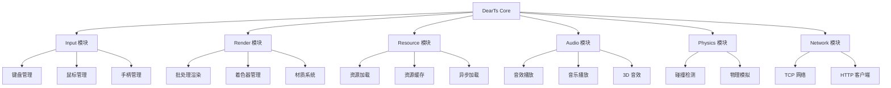

## 版本演进路线

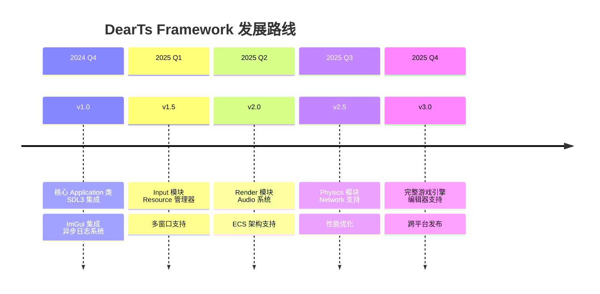
