# DearTs 应用程序架构设计文档

## 概述

DearTs 是一个基于 ImHex 架构设计的现代化 C++ GUI 应用程序框架，采用分层架构、事件驱动、插件化设计模式。本文档详细描述了应用程序的完整架构、生命周期和设计模式。

## 整体架构概览

### 架构层次

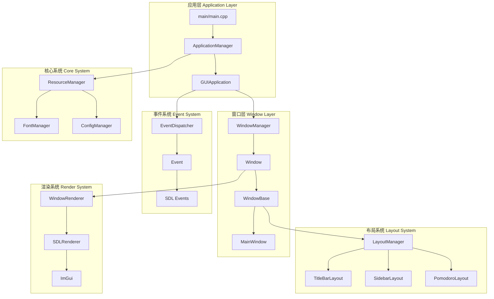

## 应用程序生命周期

### 1. 启动阶段 (Startup Phase)

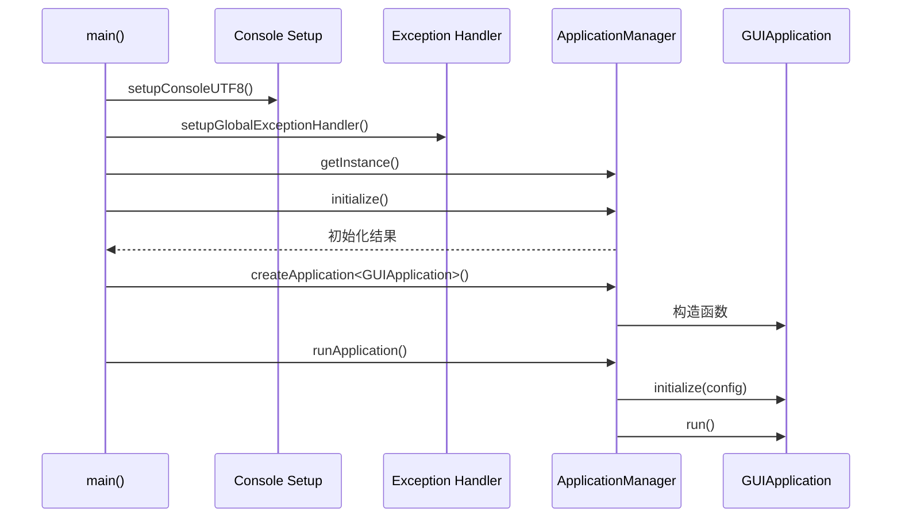

### 2. GUIApplication 初始化流程

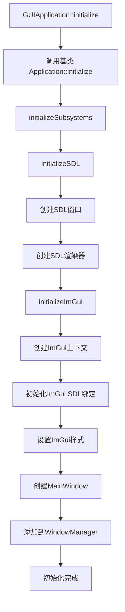

### 3. 主循环 (Main Loop)

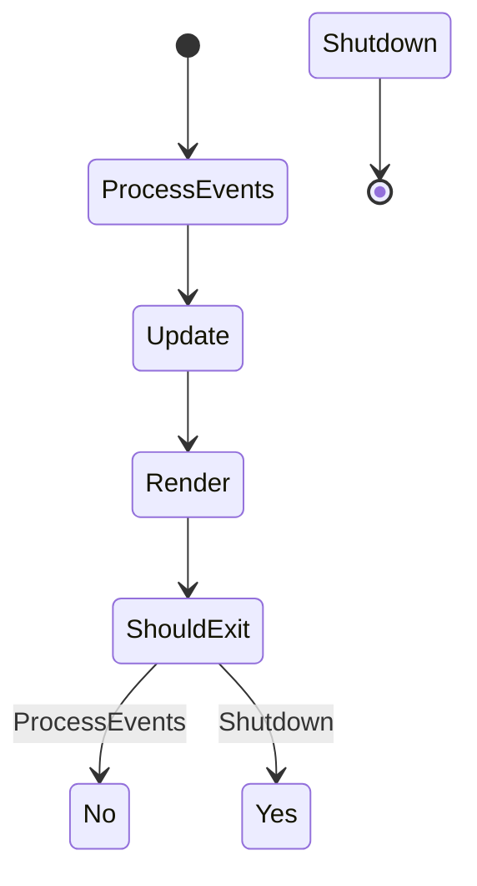

### 4. 关闭阶段 (Shutdown Phase)

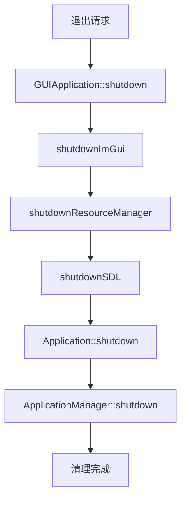

## 核心组件架构

### 1. 应用程序管理层 (Application Management Layer)

#### ApplicationManager
- **职责**: 应用程序生命周期管理、插件系统、全局配置
- **设计模式**: 单例模式、工厂模式
- **关键方法**:
  - `initialize()`: 初始化应用管理器
  - `createApplication<T>()`: 工厂方法创建应用实例
  - `runApplication()`: 运行应用程序

#### Application 基类
- **职责**: 提供应用程序基础框架
- **设计模式**: 模板方法模式
- **生命周期方法**:
  - `onInitialize()`: 初始化钩子
  - `onUpdate()`: 更新钩子
  - `onRender()`: 渲染钩子
  - `onShutdown()`: 关闭钩子

#### GUIApplication
- **职责**: GUI应用程序具体实现
- **继承**: 继承自 Application
- **关键组件**:
  - SDL 窗口和渲染器管理
  - ImGui 集成
  - 主窗口管理

### 2. 窗口系统架构 (Window System Architecture)

#### 双层窗口架构

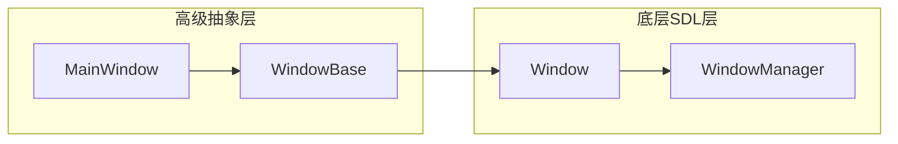

**关键设计**:
- **Window**: 底层 SDL 窗口包装类，处理原生 SDL 事件
- **WindowBase**: 高级抽象基类，包含布局管理和自定义功能
- **关联机制**: WindowBase 通过 `window_->setUserData(this)` 设置关联

#### 事件传递链

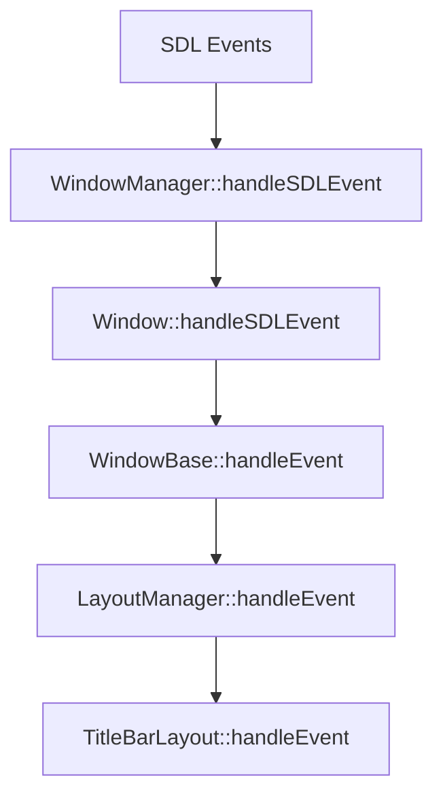

**修复说明**: 原先事件传递链在 Window 和 WindowManager 层只处理 `SDL_WINDOWEVENT`，现已修复支持鼠标事件传递。

### 3. 布局系统架构 (Layout System Architecture)

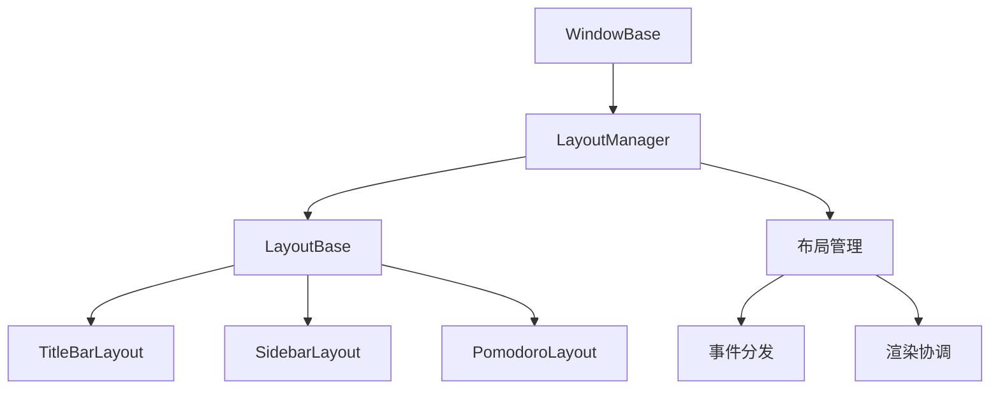

#### LayoutManager
- **职责**: 统一管理所有布局对象
- **设计模式**: 组合模式、策略模式
- **关键功能**:
  - 布局注册和注销
  - 事件分发
  - 渲染协调

#### LayoutBase 抽象基类
- **职责**: 定义布局接口
- **纯虚函数**:
  - `render()`: 渲染布局
  - `handleEvent()`: 处理事件
  - `update()`: 更新状态

### 4. 事件系统架构 (Event System Architecture)

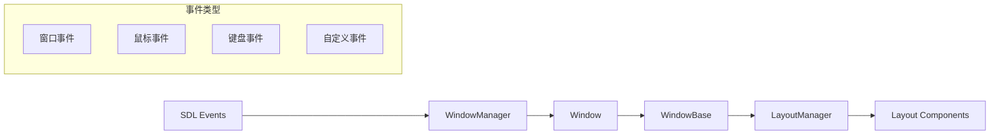

#### 事件类型映射
```cpp
// SDL 事件到内部事件的映射
SDL_MOUSEBUTTONDOWN -> TitleBarLayout::handleEvent
SDL_MOUSEBUTTONUP   -> TitleBarLayout::handleEvent
SDL_MOUSEMOTION     -> TitleBarLayout::handleEvent
SDL_WINDOWEVENT     -> Window::handleSDLEvent
```

### 5. 渲染系统架构 (Render System Architecture)

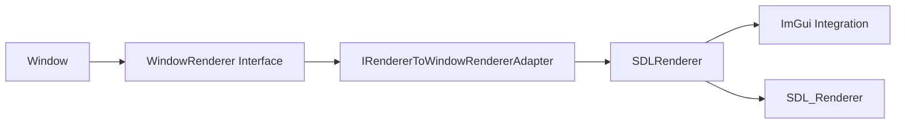

#### 适配器模式应用
- **WindowRenderer**: 渲染器抽象接口
- **SDLRenderer**: SDL 渲染器实现
- **IRendererToWindowRendererAdapter**: 适配器，桥接接口与实现

## 设计模式应用

### 1. 单例模式 (Singleton Pattern)
- **应用**: ApplicationManager, WindowManager, LayoutManager
- **目的**: 确保全局唯一实例

### 2. 工厂模式 (Factory Pattern)
- **应用**: ApplicationManager::createApplication<T>()
- **目的**: 解耦对象创建和使用

### 3. 观察者模式 (Observer Pattern)
- **应用**: 事件系统
- **目的**: 实现松耦合的事件通信

### 4. 适配器模式 (Adapter Pattern)
- **应用**: IRendererToWindowRendererAdapter
- **目的**: 兼容不同的渲染器接口

### 5. 模板方法模式 (Template Method Pattern)
- **应用**: Application 基类生命周期方法
- **目的**: 定义算法骨架，子类实现具体步骤

### 6. 组合模式 (Composite Pattern)
- **应用**: Layout 系统
- **目的**: 统一处理单个组件和组合组件

## 关键技术实现

### 1. 自定义标题栏实现

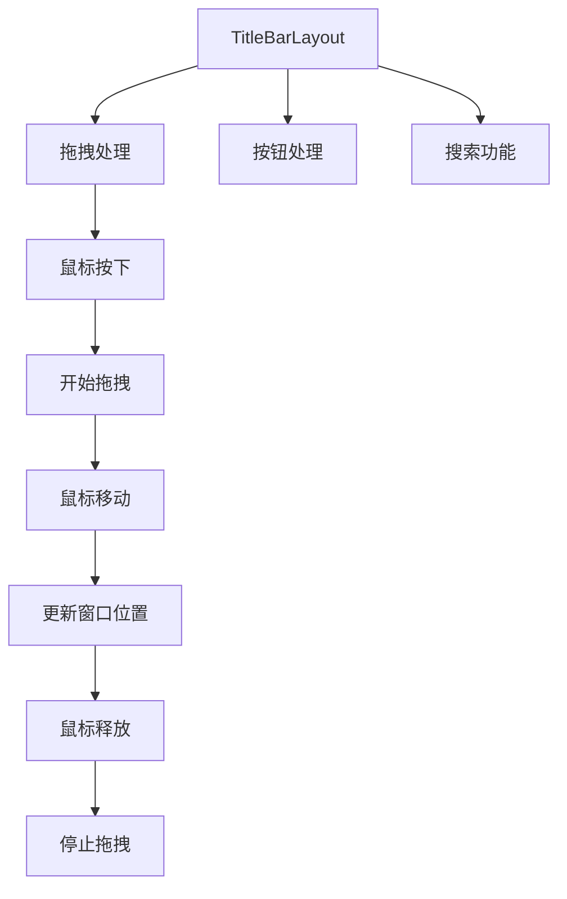

### 2. 资源管理机制

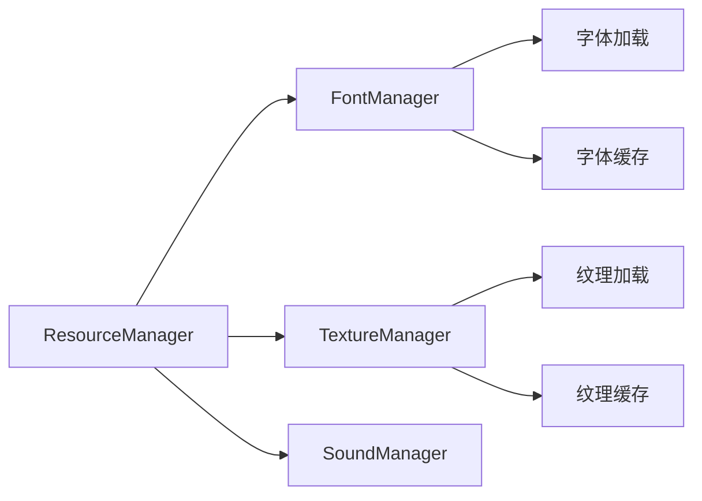

### 3. 插件系统架构

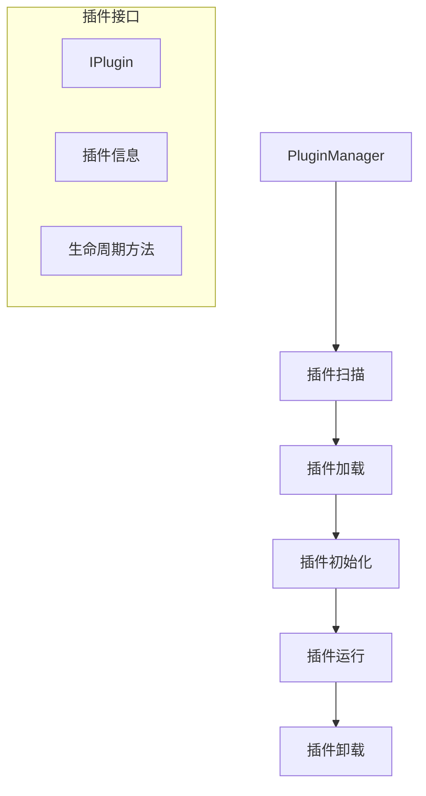

## 配置和构建

### 目录结构
```
DearTs/
├── main/
│   ├── main.cpp                 # 应用程序入口
│   └── gui/                     # GUI层
│       ├── include/
│       └── source/
├── core/                        # 核心系统
│   ├── app/                     # 应用管理
│   ├── window/                  # 窗口系统
│   ├── events/                  # 事件系统
│   ├── resource/                # 资源管理
│   └── utils/                   # 工具类
├── lib/                         # 第三方库
└── build/                       # 构建输出
```

### 依赖关系
- **SDL2**: 底层窗口和输入处理
- **ImGui**: 即时模式GUI库
- **SDL_image**: 图像加载支持
- **CMake**: 构建系统

## 性能优化

### 1. 渲染优化
- 拖拽时降低渲染频率（30FPS）
- 智能重绘机制
- 资源缓存策略

### 2. 事件处理优化
- 事件类型过滤
- 事件处理优先级
- 异步事件处理

### 3. 内存管理
- RAII 原则
- 智能指针使用
- 对象池机制

## 总结

DearTs 采用了现代 C++ 的最佳实践，通过分层架构、设计模式和事件驱动机制，构建了一个可扩展、可维护的 GUI 应用程序框架。关键特性包括：

1. **清晰的架构分层**: 应用层、窗口层、布局层、事件层、渲染层
2. **灵活的布局系统**: 支持自定义布局和组件
3. **完整的事件处理**: 从 SDL 事件到组件响应的完整链路
4. **可扩展的插件系统**: 支持动态加载和卸载插件
5. **现代渲染支持**: ImGui 集成和自定义渲染器支持

这个架构为构建复杂的桌面应用程序提供了坚实的基础，同时保持了代码的可读性和可维护性。