# DearTs 应用程序运行流程图

## 整体架构

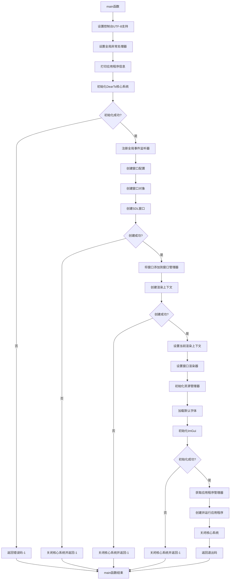

## 详细流程说明

### 1. 应用程序启动阶段

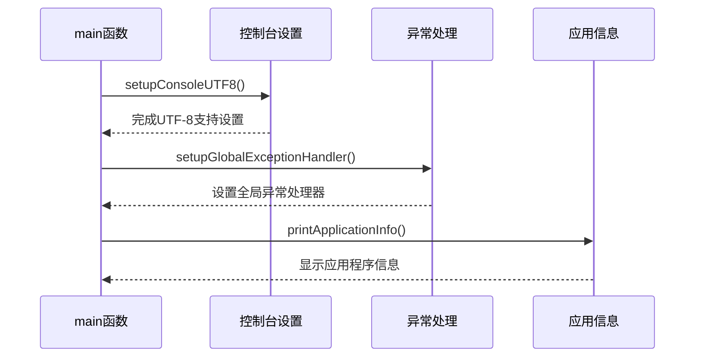

### 2. 核心系统初始化

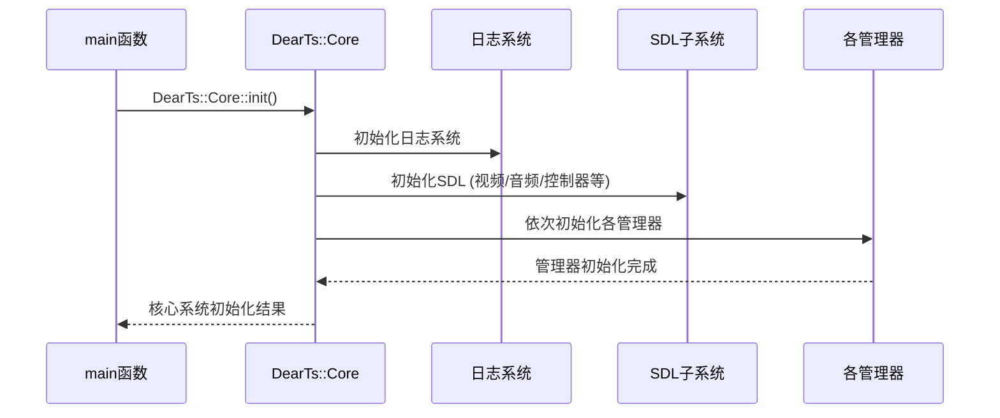

### 3. 窗口和渲染系统初始化

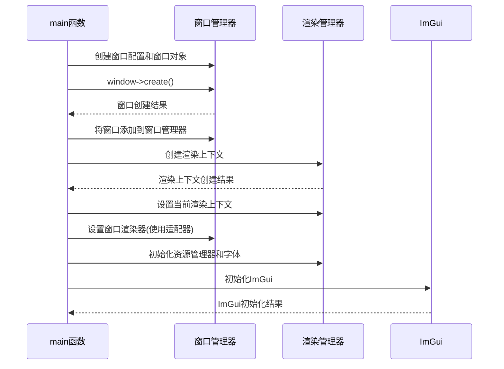

### 4. 应用程序运行阶段

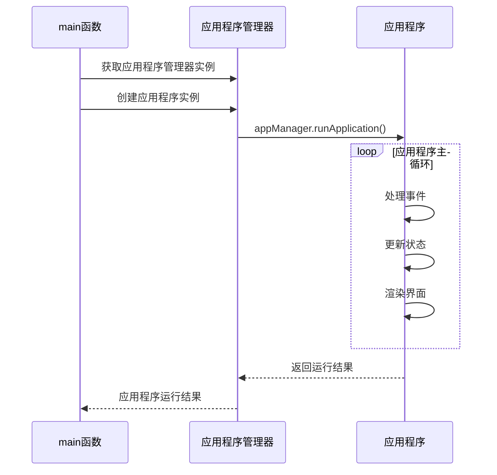

### 5. 系统关闭阶段

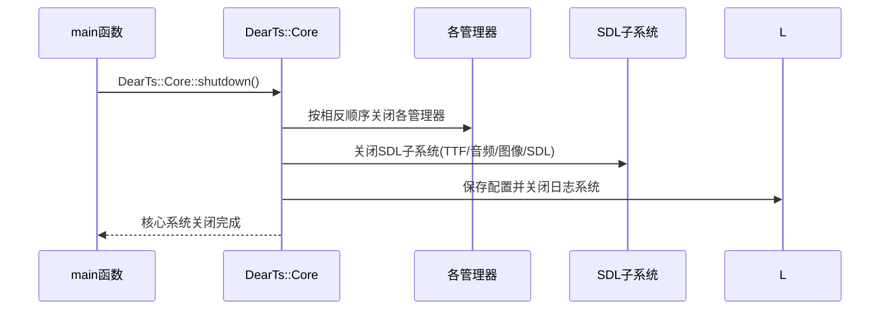

## GUI子系统完整生命周期架构 (main/gui)

### GUI架构概览

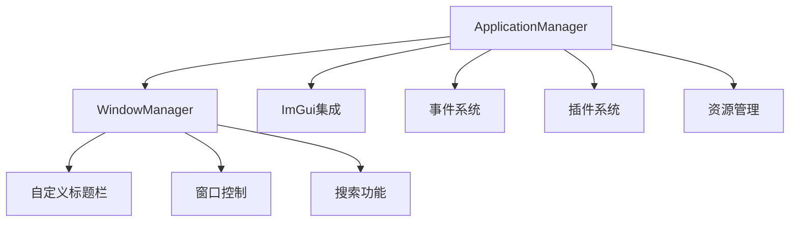

### ApplicationManager 生命周期

```mermaid
graph LR
    A[构造函数] --> B[initialize()]
    B --> C{初始化成功?}
    C -->|是| D[run()]
    C -->|否| E[返回错误]
    D --> F{主循环}
    F --> G[processEvents()]
    F --> H[update()]
    F --> I[render()]
    F --> J{是否退出?}
    J -->|否| F
    J -->|是| K[shutdown()]
```

### WindowManager 初始化流程

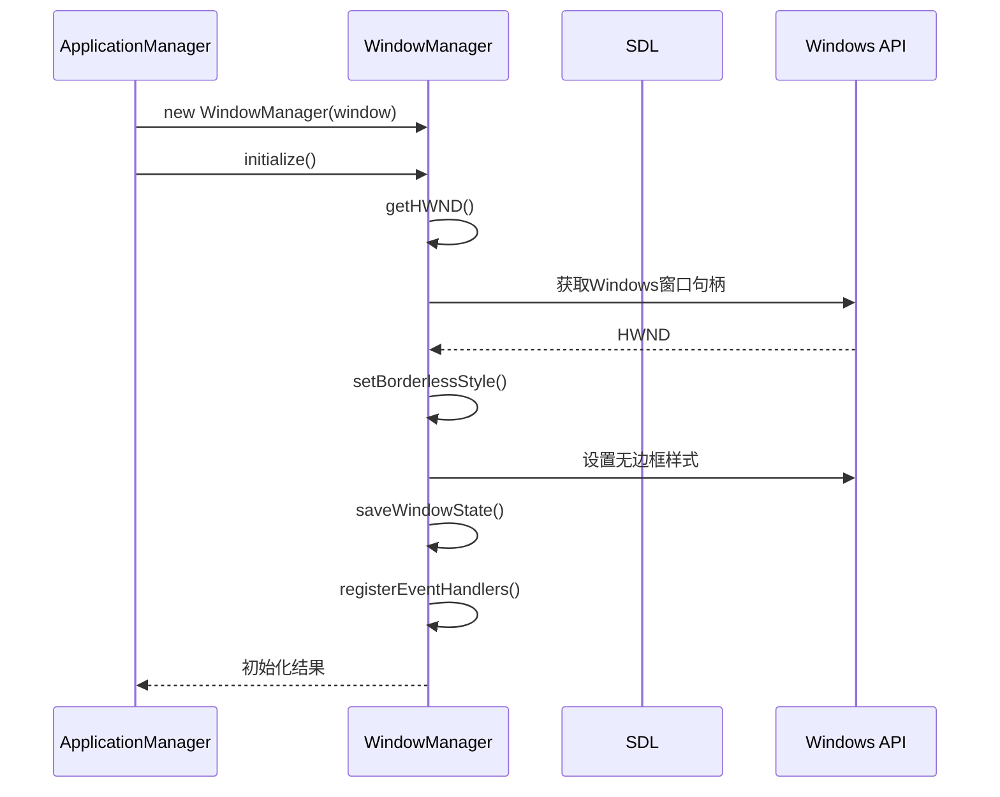

### 主循环处理流程

```mermaid
graph TD
    A[主循环] --> B[processEvents()]
    B --> C[事件处理]
    C --> D[SDL事件轮询]
    D --> E{事件类型}
    E --> F[鼠标事件]
    E --> G[键盘事件]
    E --> H[窗口事件]
    E --> I[ImGui事件]
    
    F --> J[WindowManager.handleEvent()]
    J --> K[拖拽处理]
    J --> L[按钮点击]
    
    G --> M[快捷键处理]
    G --> N[搜索对话框]
    
    H --> O[最小化/最大化]
    H --> P[窗口关闭]
    
    I --> Q[ImGui内部处理]
    
    A --> R[update()]
    R --> S[状态更新]
    S --> T[插件更新]
    S --> U[事件发布]
    
    A --> V[render()]
    V --> W[清屏]
    V --> X[ImGui新帧]
    V --> Y[标题栏渲染]
    V --> Z[主界面渲染]
    V --> AA[插件界面渲染]
    V --> AB[ImGui渲染]
    V --> AC[SDL呈现]
```

### 窗口控制功能

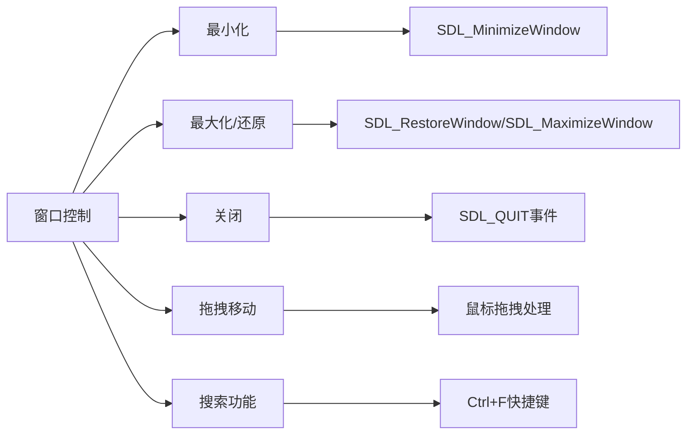

## 关键组件说明

### 核心管理器初始化顺序

1. **日志管理器** - 提供日志输出功能
2. **配置管理器** - 管理应用程序配置
3. **性能分析器** - 提供性能监控功能
4. **SDL库** - 初始化视频、音频等子系统
5. **事件系统** - 处理应用程序事件
6. **窗口管理器** - 管理应用程序窗口
7. **渲染管理器** - 管理渲染上下文和渲染器
8. **输入管理器** - 处理用户输入
9. **资源管理器** - 管理应用程序资源
10. **音频管理器** - 处理音频播放
11. **应用程序管理器** - 管理应用程序生命周期

### 窗口和渲染系统架构

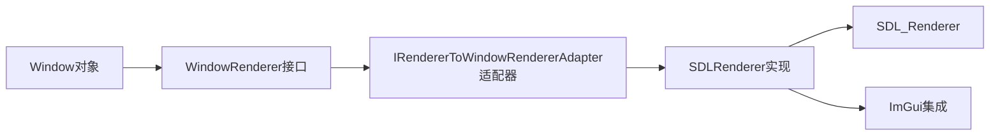

### GUI子系统架构

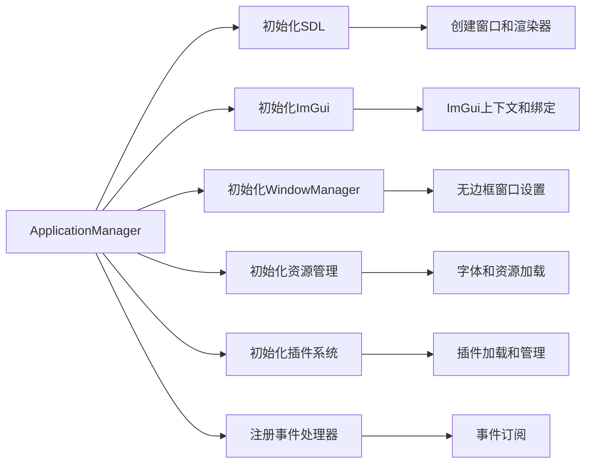

### 异常处理机制

1. **全局异常处理器** - 捕获未处理的异常并显示错误信息
2. **各阶段错误检查** - 每个关键步骤都会检查执行结果
3. **资源清理** - 出错时会自动清理已分配的资源

## 应用程序生命周期

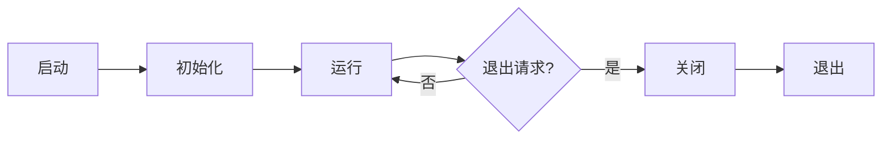

这个流程图展示了DearTs应用程序从启动到退出的完整生命周期，包括了所有关键的初始化步骤、运行时循环以及系统关闭过程。GUI子系统的完整生命周期架构也已详细说明，展示了ApplicationManager和WindowManager如何协同工作来提供现代化的用户界面体验。